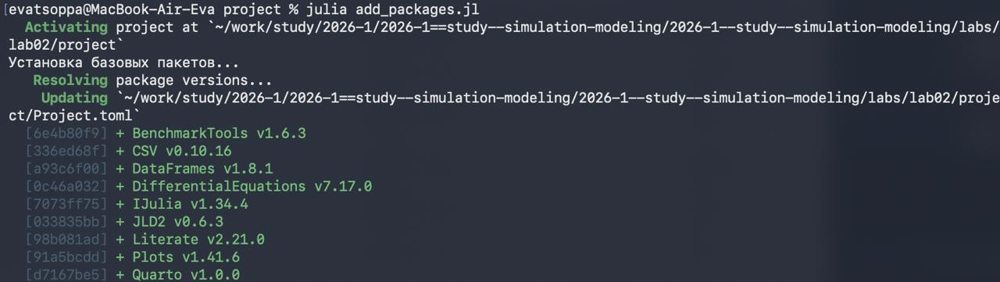
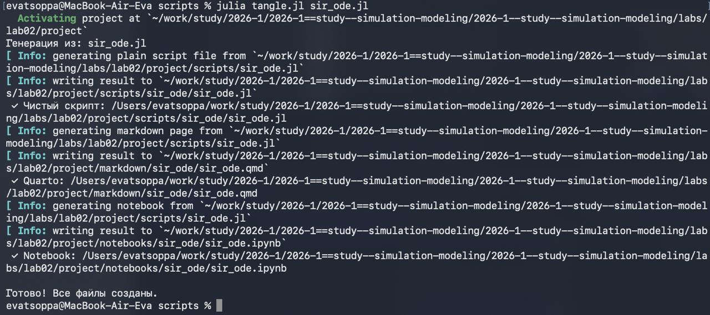
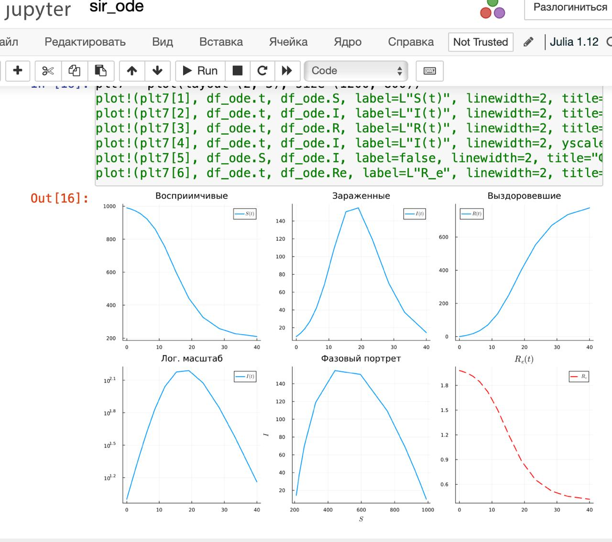
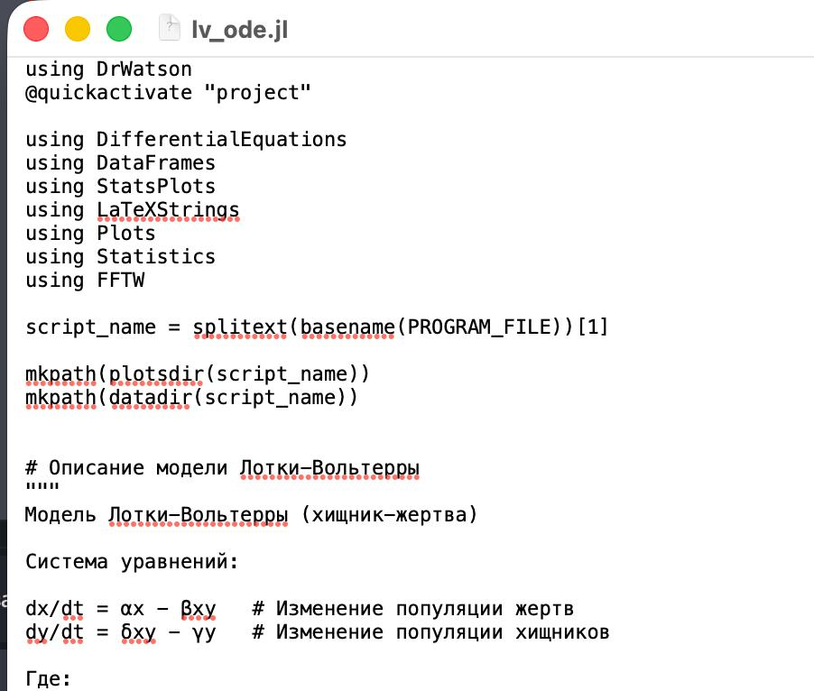
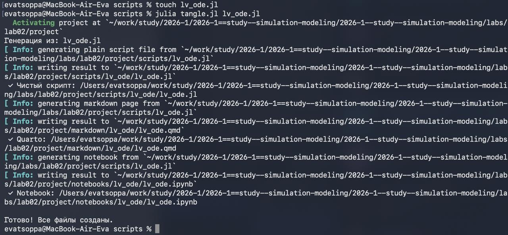
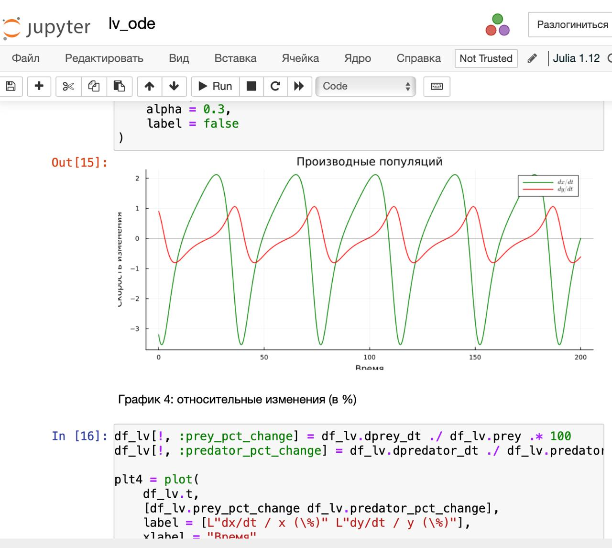
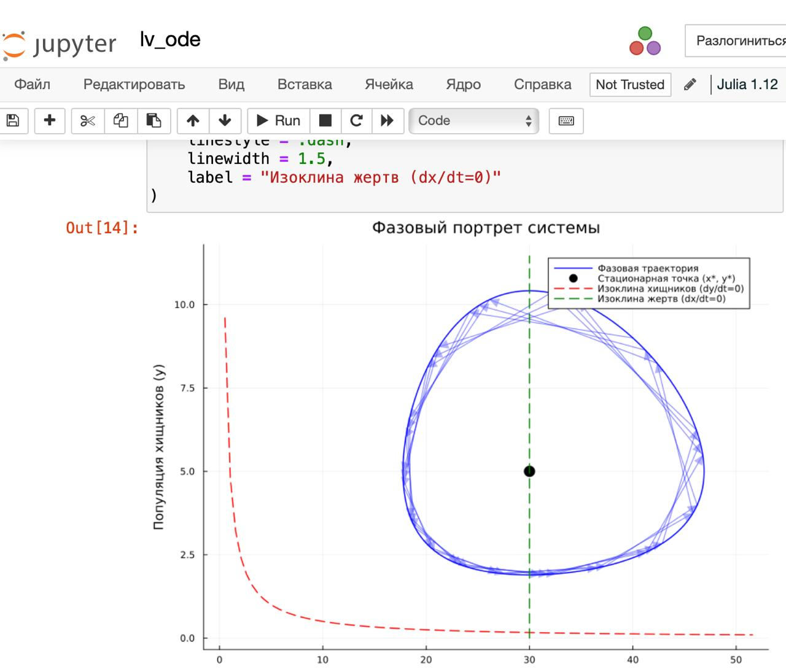
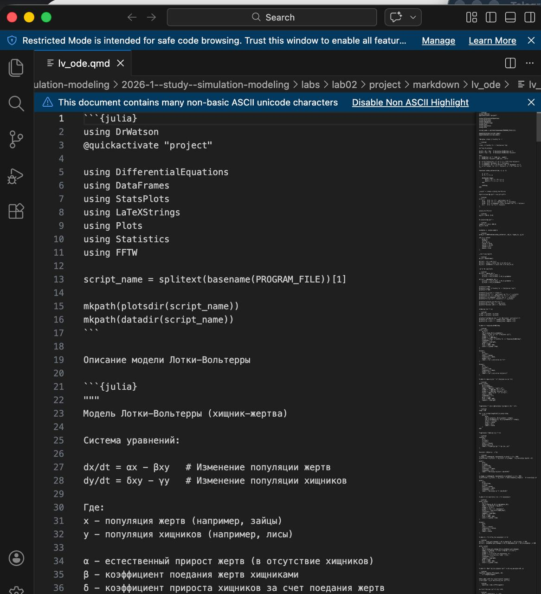
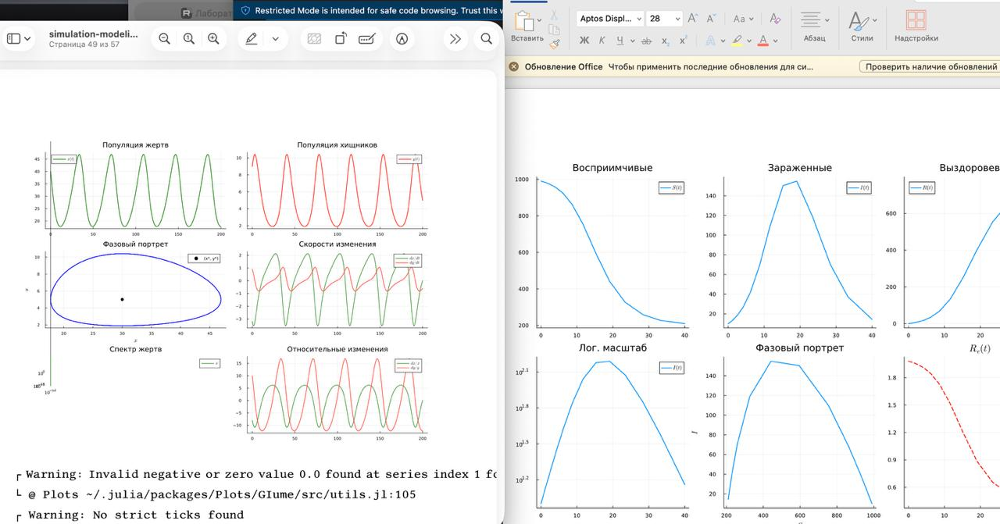

---
## Author
author:
  name: Цоппа Ева Эдуардовна
  email: 1132236045@rudn.ru
  affiliation:
    - name: Российский университет дружбы народов
      country: Российская Федерация
      postal-code: 117198
      city: Москва
      address: ул. Миклухо-Маклая, д. 5

## Title
title: "Отчёт по лабораторной работе №2"
subtitle: "Имитационное моделирование"
license: "CC BY"
---

# Задание

— Создать рабочий каталог для кода.
— Установить необходимые пакеты.
— Выполнить предложенный код.
— Преобразовать код в литературный стиль.
— Сгенерировать из литературного кода:
    — чистый код;
    — jupyter notebook;
    — документацию в формате Quarto.
— Выполнить код из jupyter notebook.
— Интегрировать документацию в формате Quarto в отчёт.
— Добавить в код в литературном стиле вычисление для набора параметров.
— Сгенерировать из литературного кода с параметрами:
    — чистый код;
    — jupyter notebook;
    — документацию в формате Quarto.
— Выполнить код из jupyter notebook с параметрами.
— Интегрировать документацию с параметрами в формате Quarto в отчёт.

# Теоретическое введение

### Модель SIR

Модель SIR есть классическая и фундаментальная математическая модель эпиде-
миологии, описывающая распространение инфекционного заболевания в закры-
той популяции.

#### Базовая модель

Модель SIR делит всю популяцию на три взаимосвязанные группы (компартмен-
ты), что отражено в её названии:
𝑆 — Susceptible (Восприимчивые): люди, которые не болели, не имеют иммуни-
тета и могут заразиться.
𝐼 — Infectious (Инфицированные/Заразные): люди, которые в данный момент
больны и могут передавать инфекцию.
𝑅 — Recovered (Выздоровевшие/Удаленные): люди, которые переболели и при-
обрели иммунитет (или умерли). Они больше не участвуют в процессе переда-
чи.

Основная цель модели: не предсказать судьбу конкретного человека, а понять общую динамику эпидемии — будет ли она разрастаться, как быстро, сколько
людей в итоге переболеет, как влияют карантинные меры.

#### Трёхпараметрическая модель SIR

В классической двухпараметрической модели (𝛽, 𝛾) параметр 𝛽 (коэффициент заражения) является составным. Он скрывает в себе два процесса:
— Контакт между людьми (поведенческий, управляемый фактор).
— Передачу инфекции при контакте (биологический фактор).

Трёхпараметрическая модель делает это разделение явным:
— 𝑐 — среднее число контактов (достаточно тесных для передачи инфекции)
одного человека в единицу времени.
— 𝛽 — вероятность передачи инфекции при одном контакте между заразным и
восприимчивым (безразмерная величина, от 0 до 1).
— 𝛾 — скорость выздоровления (доля инфицированных, выздоравливающих в
единицу времени). Как и раньше, 1/𝛾 — средняя продолжительность заразного
периода.

Итоговый параметр силы заражения теперь выражается как произведение: 𝑐 ⋅ 𝛽.

### Модель Лотки–Вольтерры

Модель Лотки-Вольтерры — это фундаментальная математическая модель в эко-
логии, описывающая динамику взаимодействия двух видов: хищников и жертв.
Она была независимо предложена в 1920-х годах:

— Альфредом Лоткой (1925) для химических реакций.
— Витторио Вольтеррой (1926) для объяснения колебаний улова рыбы в Адриати-
ческом море.

Модель демонстрирует, как даже простая система взаимодействий может порож-
дать сложные колебательные режимы, объясняя циклические изменения числен-
ности в природных экосистемах.

# Цель работы

Цель данной лабораторной работы - изучить основные модели SIR и Лотки-Вольтерры, а также изучить аспекты их программной реализации.

# Выполнение лабораторной работы

## Подготовка рабочего пространства

В этом разделе мы будем использовать уже известные нам скрипты из 1-ой лабораторной работы.

Создадим каталог проекта DrWatson с помощью скрипта setup_project.jl ([рис. @fig-001]).

{#fig-001 width=70%}

Добавим необходимые пакеты с помоощью скрипта add_packages.jl ([рис. @fig-002]).

{#fig-002 width=70%}

Проверим корректность установки с помощью скрипта scripts/test_setup.jl ([рис. @fig-003]).

{#fig-003 width=70%}

## Основные модели

### Модель SIR

Создаём файл scripts/sir_ode.jl с реализацией модели ([рис. @fig-004]).

{#fig-004 width=70%}

Создадим производные форматы ([рис. @fig-005]).

{#fig-005 width=70%}

Просмотрим jupyter-notebook ([рис. @fig-006]).

{#fig-006 width=70%}

Просмотрим jupyter-notebook ([рис. @fig-007]).

{#fig-007 width=70%}

Просмотрим каталог с графиками ([рис. @fig-008]).

{#fig-008 width=70%}

Просмотрим qmd файл ([рис. @fig-009]).

{#fig-009 width=70%}

### Модель Лотки–Вольтерры

Создаём файл scripts/lv_ode.jl с реализацией модели ([рис. @fig-010]).

{#fig-010 width=70%}

Создадим производные форматы ([рис. @fig-011]).

{#fig-011 width=70%}

Просмотрим jupyter-notebook ([рис. @fig-012]).

{#fig-012 width=70%}

Просмотрим jjupyter-notebook ([рис. @fig-013]).

{#fig-013 width=70%}

Просмотрим каталог с графиками ([рис. @fig-014]).

{#fig-014 width=70%}

Просмотрим qmd файл ([рис. @fig-015]).

{#fig-015 width=70%}

В файле отчёта после описания выполнения лабораторной работы подключим файл описания программы ([рис. @fig-016]).

{#fig-016 width=70%}

Результат ([рис. @fig-017]).

{#fig-017 width=70%}

# Модель SIR 



# Модель Лотки–Вольтерры



# Выводы

В ходе данной лабораторной работы мной были изучены основные модели SIR и Лотки-Вольтерры, а также аспекты их программной реализации.

# Список литературы

1. Kermack W. O., McKendrick A. G. A Contribution to the Mathematical Theory of
Epidemics // Proceedings of the Royal Society of London. Series A, Containing Papers
of a Mathematical and Physical Character. — 1927. — Авг. — Т. 115, № 772. — С. 700—
721. 

2. Hethcote H. W. The Mathematics of Infectious Diseases // SIAM Review. — 2000. —
Янв. — Т. 42, № 4. — С. 599—653. — ISSN 1095-7200. — DOI: 10.1137/s0036144500
371907.

3. Lotka A. J. Elements of Physical Biology. — Baltimore : Williams, Wilkins Company,
1925. — 435 p.

4. Lotka A. J. Contribution to the Theory of Periodic Reaction // The Journal of Physical
Chemistry A. — 1910. — Т. 14, № 3. — С. 271—274.

5. Volterra V. Variations and fluctuations of the number of individuals in animal species
living together // Journal du Conseil permanent International pour l’ Exploration de
la Mer. — 1928. — Т. 3, № 1. — С. 3—51.

6. Вольтерра B. Математическая теория борьбы за существование : пер. с фр. —
Москва : Наука, 1976.. — 288 с. 
