---
## Author
author:
  name: Цоппа Ева Эдуардовна
  email: 1132236045@rudn.ru
  affiliation:
    - name: Российский университет дружбы народов
      country: Российская Федерация
      postal-code: 117198
      city: Москва
      address: ул. Миклухо-Маклая, д. 5

## Title
title: "Отчёт по лабораторной работе №4"
subtitle: "Имитационное моделирование"
license: "CC BY"
---

# Теоретическое введение

## 4.1.1.1 Классическая модель SIR

Модель SIR, предложенная Кермаком и Маккендриком в 1927 году, описывает
динамику эпидемии в популяции, разделённой на три группы:

— 𝑆 (Susceptible) — восприимчивые к заболеванию индивиды;
— 𝐼 (Infectious) — инфицированные, способные заражать восприимчивых;
— 𝑅 (Recovered) — выздоровевшие (или умершие), получившие иммунитет и более

не участвующие в распространении.

Классическая модель описывается системой обыкновенных дифференциальных
уравнений:

𝑑𝑆/𝑑𝑡 = −𝛽𝑆𝐼/𝑁 ,
𝑑𝐼/𝑑𝑡 = 𝛽𝑆𝐼/𝑁 − 𝛾𝐼,
𝑑𝑅/𝑑𝑡 = 𝛾𝐼.

где 𝛽 — коэффициент передачи инфекции, 𝛾 — скорость выздоровления.

## 4.1.1.2 Ограничения классического подхода

Несмотря на широкое применение, модель на ОДУ имеет ряд ограничений:

— Однородность популяции — все индивиды считаются одинаковыми.
— Отсутствие пространственной структуры — предполагается полное перемеши-
вание.
— Детерминированность — не учитываются случайные флуктуации.
— Непрерывность — количество людей рассматривается как непрерывная вели-
чина.

## 4.1.1.3 Преимущества агентного подхода

Агентное моделирование позволяет преодолеть эти ограничения:

— Каждый индивид моделируется отдельно с уникальными характеристиками.
— Взаимодействия происходят локально в пространстве или социальной сети.
— Процессы носят стохастический характер.
— Можно учитывать гетерогенность контактов, мобильность, меры контроля.

# Задание

— Создать рабочий каталог для кода.
— Установить необходимые пакеты.
— Выполнить предложенный код.
— Преобразовать код в литературный стиль.
— Сгенерировать из литературного кода:
    — чистый код;
    — jupyter notebook;
    — документацию в формате Quarto.
— Выполнить код из jupyter notebook.
— Интегрировать документацию в формате Quarto в отчёт.
— Добавить в код в литературном стиле вычисление для набора параметров.
— Сгенерировать из литературного кода с параметрами:
    — чистый код;
    — jupyter notebook;
    — документацию в формате Quarto.
— Выполнить код из jupyter notebook с параметрами.
— Интегрировать документацию с параметрами в формате Quarto в отчёт.

# Цель работы

Цель данной работы - сравнить детерминированный (модель SIR на ОДУ) и стохастический (агентный) подходы к моделированию эпидемий, оценив преимущества агентного моделирования в учёте пространственной структуры и индивидуальных характеристик агентов.

# Выполнение лабораторной работы

Предварительно проверим правильность структуры нашего проекта ([рис. @fig-001]).

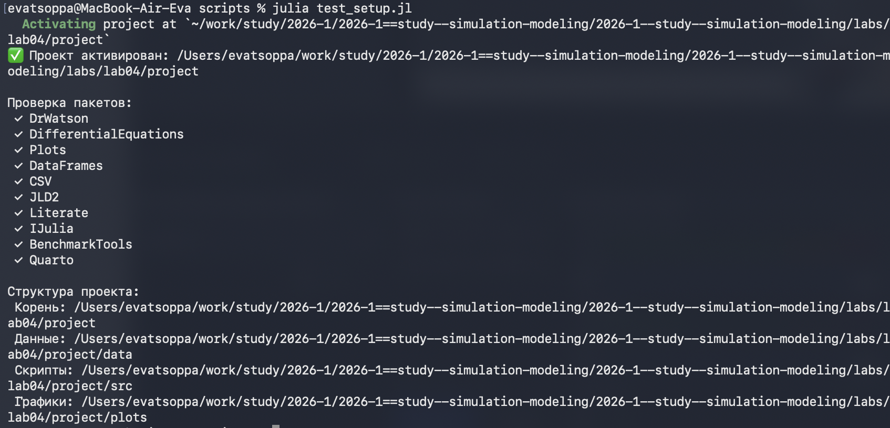{#fig-001 width=70%}

## Код модели

Создадим файл src/sir_model.jl с описанием базовой модели SIR ([рис. @fig-002]).

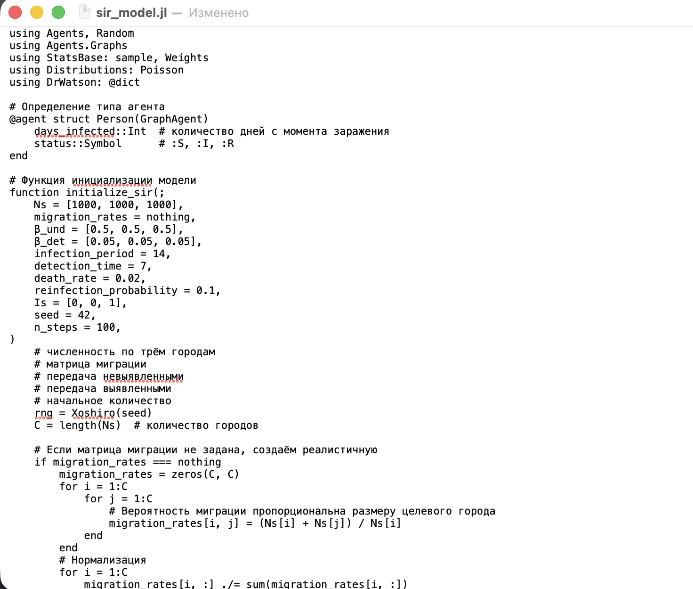{#fig-002 width=70%}

## Базовый эксперимент

Создадим файл scripts/sir_run_basic.jl. Код в нём запускает один эксперимент с фиксированными параметрами (по умолчанию) и
сохраняет динамику численности агентов. Это служит для проверки работоспо-
собности модели и получения базового понимания эпидемического процесса. ([рис. @fig-003]).

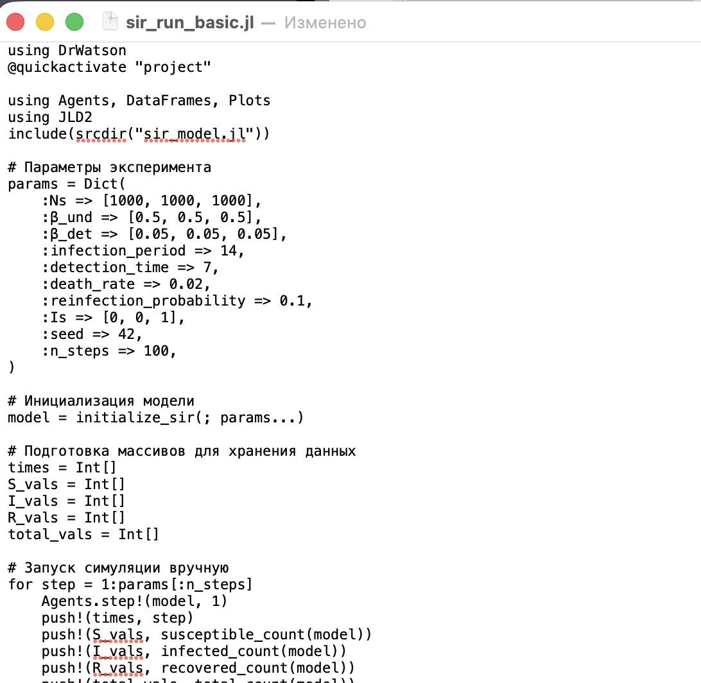{#fig-003 width=70%}

Запустим скрипт ([рис. @fig-004]).

{#fig-004 width=70%}

Создадим проивзодные форматы с помощью скрипта tangle.jl ([рис. @fig-005]).

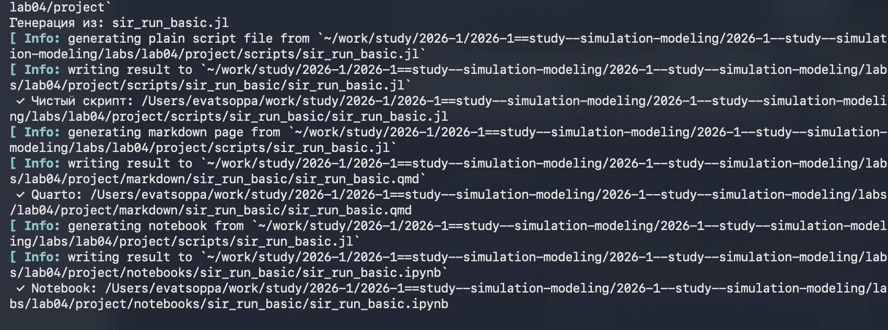{#fig-005 width=70%}

Запустим файл ipynb в jupyter-notebook ([рис. @fig-006]).

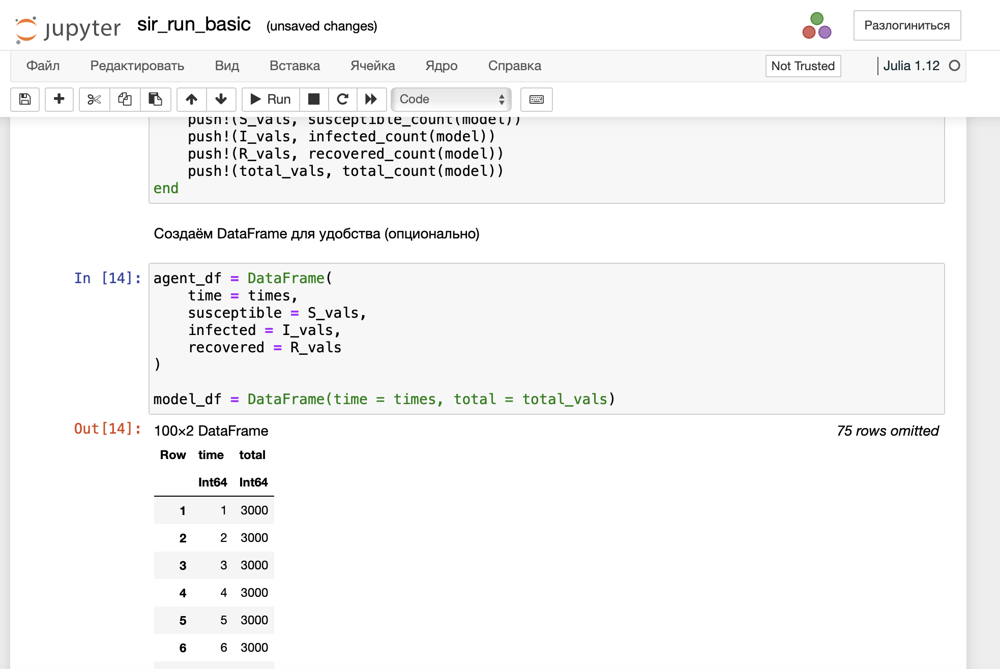{#fig-006 width=70%}

## Сканирование коэффициента заразности

Создадим файл scripts/sir_scan_beta.jl. Исследует, как изменение базовой заразности (β_undи пропорционально β_det)
влияет на эпидемические показатели: пик заболеваемости, долю переболевших,
число умерших. Выполняется параметрическое сканирование с несколькими
повторными прогонами для учёта стохастичности. ([рис. @fig-007]).

{#fig-007 width=70%}

Успешное завершение экспериментов ([рис. @fig-008]).

{#fig-008 width=70%}

Просмотрим результирующую таблицу ([рис. @fig-009]).

{#fig-009 width=70%}

Создадим проивзодные форматы с помощью скрипта tangle.jl ([рис. @fig-010]).

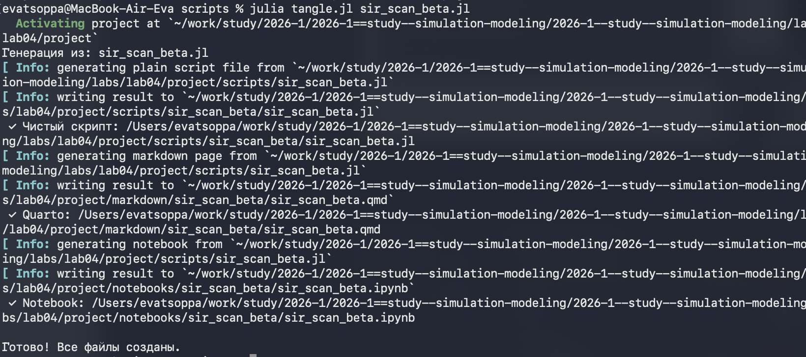{#fig-010 width=70%}

Запустим файл ipynb в jupyter-notebook ([рис. @fig-011]).

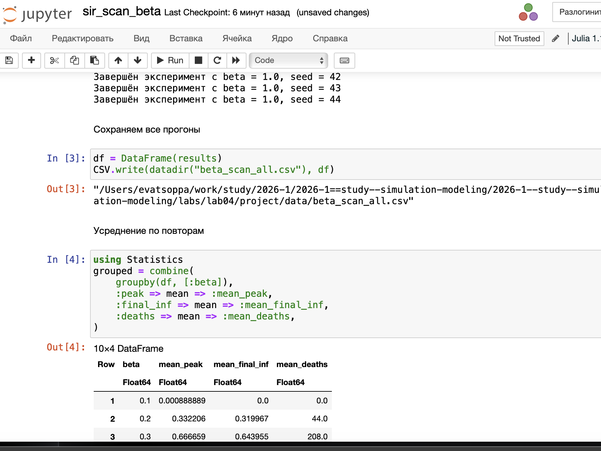{#fig-011 width=70%}

## Исследование эффекта миграции

Создадим файл scripts/sir_migration_effect.jl. Исследует, как интенсивность перемещения людей между городами влияет на
скорость распространения эпидемии (время достижения пика) и масштаб пика.
Инфекция начинается только в одном городе, остальные изначально здоровы. ([рис. @fig-012]).

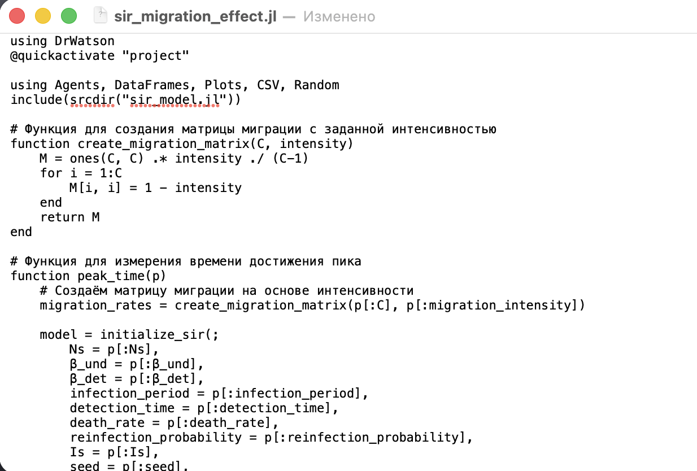{#fig-012 width=70%}

Успешное завершение экспериментов ([рис. @fig-013]).

{#fig-013 width=70%}

Просмотрим результирующую таблицу ([рис. @fig-014]).

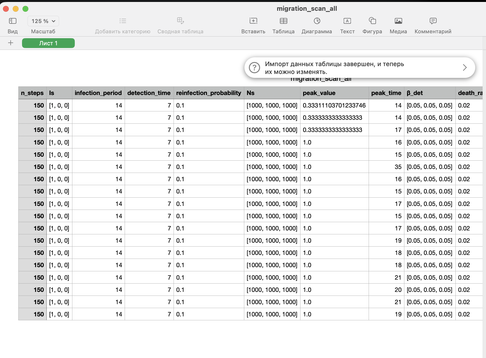{#fig-014 width=70%}

Создадим проивзодные форматы с помощью скрипта tangle.jl ([рис. @fig-015]).

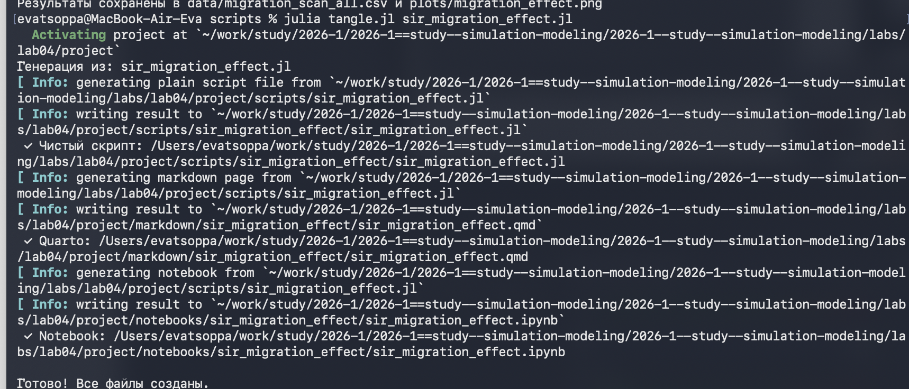{#fig-015 width=70%}

Запустим файл ipynb в jupyter-notebook ([рис. @fig-016]).

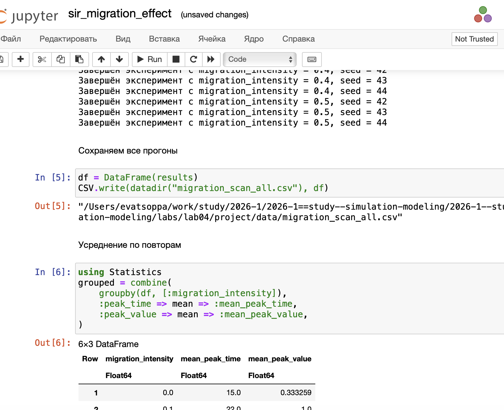{#fig-016 width=70%}

## Многокритериальная оптимизация параметров

Создадим файл scripts/sir_optimize_parameters.jl. Ищет оптимальные комбинации параметров, минимизирующие одновременно
два критерия: пиковую заболеваемость и долю умерших. Использует эволюцион-
ный алгоритм (Borg MOEA) из пакета BlackBoxOptim. ([рис. @fig-017]).

{#fig-017 width=70%}

Успешное завершение ([рис. @fig-018]).

{#fig-018 width=70%}

Создадим проивзодные форматы с помощью скрипта tangle.jl ([рис. @fig-019]).

{#fig-019 width=70%}

Запустим файл ipynb в jupyter-notebook ([рис. @fig-020]).

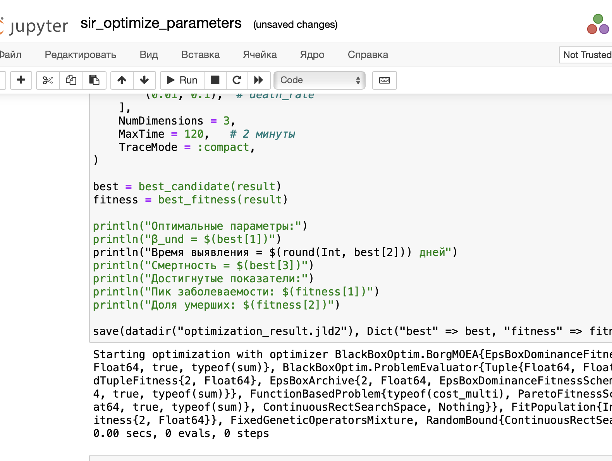{#fig-020 width=70%}

## Сводная визуализация результатов

Создадим файл scripts/sir_visualize_dynamics.jl. Этот скрипт загружает результаты параметрического сканирования (файл
data/beta_scan_all.csv, созданный scan_beta.jl) и строит единый составной
график, объединяющий три панели:
— пик эпидемии и конечная доля инфицированных;
— число умерших;
— доля выздоровевших. ([рис. @fig-021]).

{#fig-021 width=70%}

Запуск скрипта ([рис. @fig-022]).

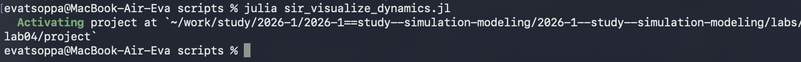{#fig-022 width=70%}

Создадим проивзодные форматы с помощью скрипта tangle.jl ([рис. @fig-023]).

{#fig-023 width=70%}

Запустим файл ipynb в jupyter-notebook ([рис. @fig-024]).

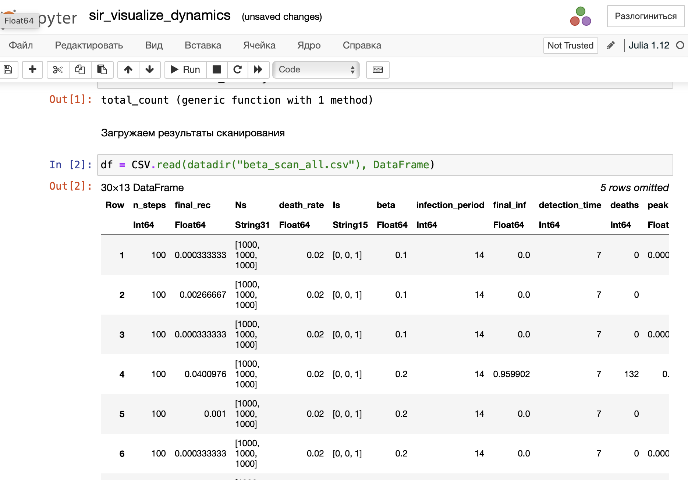{#fig-024 width=70%}

# Выводы

В ходе данной лабораторной работы мной были изучены детерминированный (модель SIR на ОДУ) и стохастический (агентный) подходы к моделированию эпидемий, оценив преимущества агентного моделирования в учёте пространственной структуры и индивидуальных характеристик агентов.

# Список литературы

1. A Multi-Language Computing Environment for Literate Programming and Repro-
ducible Research / E. Schulte [et al.] // Journal of Statistical Software. — 2012. —
Vol. 46, no. 3. — ISSN 1548-7660. — DOI: 10.18637/jss.v046.i03.

2. Daisyworld: A review / A. J. Wood [et al.] // Reviews of Geophysics. — 2008. — Jan. —
Vol. 46, no. 1. — ISSN 1944-9208. — DOI: 10.1029/2006rg000217.

3. Datseris G., Vahdati A. R., DuBois T. C. Agents.jl: a performant and feature-full agent-
based modeling software of minimal code complexity // SIMULATION. — 2022. —
Jan. — P. 003754972110688. — DOI: 10.1177/00375497211068820.

4. Hethcote H. W. The Mathematics of Infectious Diseases // SIAM Review. — 2000. —
Jan. — Vol. 42, no. 4. — P. 599–653. — ISSN 1095-7200. — DOI: 10.1137/s0036144
500371907.

5. Kermack W. O., McKendrick A. G. A Contribution to the Mathematical Theory of
Epidemics // Proceedings of the Royal Society of London. Series A Containing
Papers of a Mathematical and Physical Character. — 1927. — Авг. — Т. 115, №
772. — С. 700—721. — ISSN 2053-9150. — DOI: 10.1098/rspa.1927.0118.

6. Knuth D. E. Literate Programming // The Computer Journal. — 1984. — Feb. —
Vol. 27, no. 2. — P. 97–111. — ISSN 1460-2067. — DOI: 10.1093/comjnl/27.2.97.

7. Lotka A. J. Contribution to the Theory of Periodic Reaction // The Journal of Physical
Chemistry A. — 1910. — Vol. 14, no. 3. — P. 271–274. — DOI: 10.1021/j150111a004.

8. Lotka A. J. Elements of Physical Biology. — Baltimore : Williams, Wilkins Company,
1925. — 435 p. — URL: https://archive.org/details/elementsofphysic017171mbp.

9. The Story in the Notebook / M. B. Kery [et al.] // Proceedings of the 2018 CHI
Conference on Human Factors in Computing Systems. — ACM, 04/2018. — P. 1–
11. — DOI: 10.1145/3173574.3173748.

10. Volterra V. Variations and fluctuations of the number of individuals in animal
species living together // Journal du Conseil permanent International pour l Explo-
ration de la Mer. — 1928. — Vol. 3, no. 1. — P. 3–51.

11. Watson A. J., Lovelock J. E. Biological homeostasis of the global environment: the
parable of Daisyworld // Tellus B: Chemical and Physical Meteorology. — 1983. —
Jan. — Vol. 35, no. 4. — P. 284. — ISSN 0280-6509. — DOI: 10.3402/tellusb.v35i4.1
4616.

12. Вольтерра B. Математическая теория борьбы за существование : пер. с фр. —
М. : Наука, 1976.. — 288 с. — Пер. по изд.: Volterra V. Leçons sur la Théorie ma-
thématique de la lutte pour la vie. — Paris : Gauthiers-Villars, 1931. — ISBN
2876470667. — URL : http://www.amazon.com/lecons-theorie-math-lutte-pour/d
p/2876470667%3FSubscriptionId%3D0JYN1NVW651KCA56C102%26tag%3Dte
chkie-20%26linkCode%3Dxm2%26camp%3D2025%26creative%3D165953%26
creativeASIN%3D2876470667.
