---
## Author
author:
  name: Цоппа Ева Эдуардовна
  email: 1132236045@rudn.ru
  affiliation:
    - name: Российский университет дружбы народов
      country: Российская Федерация
      postal-code: 117198
      city: Москва
      address: ул. Миклухо-Маклая, д. 5
## Title
title: Лабораторная работа №5
subtitle: Имитационное моделирование
license: CC BY
date: 2026-04-18
date-format: "YYYY-MM-DD" 
---

## Цель работы

Цель данной работы - построить сеть Петри для пяти философов, моделируя захват и освобождение
вилок, обнаружить состояние взаимной блокировки (deadlock), когда каждый фило-
соф взял одну вилку и ждёт вторую, провести имитационное моделирование (стохастическое и детерминирован-
ное) и выявить наличие deadlock, модифицировать сеть, чтобы предотвратить deadlock.

# Выполнение лабораторной работы

## Код модели

Создадим файл src/DiningPhilosophers.jl с определением простой структуры PetriNet([рис. @fig-001]).

{#fig-001 width=70%}

## Код модели

Впишем нужный код в файл DiningPhilosophers.jl ([рис. @fig-002]).

{#fig-002 width=70%}

## Базовый эксперимент

Создадим файл scripts/dining_philosophers.jl. 
Скрипт выполняет основное моделирование и сравнение двух вариантов сети
Петри:
— классическая модель (без арбитра), в которой возможна взаимная блокировка
(deadlock);
— модифицированная модель с арбитром, которая должна предотвращать
deadlock. ([рис. @fig-003]).

{#fig-003 width=70%}

## Базовый эксперимент

Впишем нужный код в файл dining_philosophers.jl ([рис. @fig-004]).

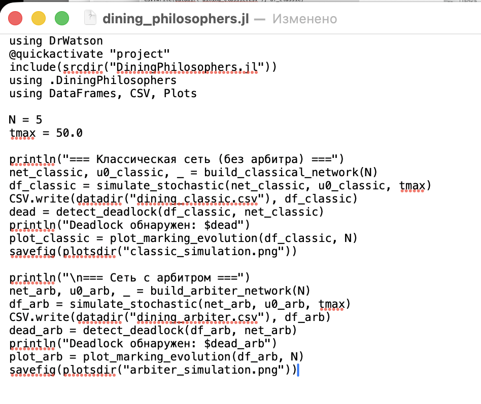{#fig-004 width=70%}

## Базовый эксперимент

Запустим скрипт ([рис. @fig-005]).

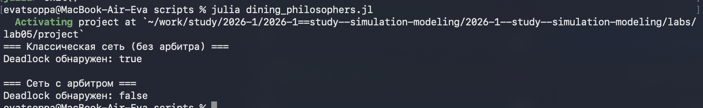{#fig-005 width=70%}

## Базовый эксперимент

Создадим проивзодные форматы с помощью скрипта tangle.jl ([рис. @fig-006]).

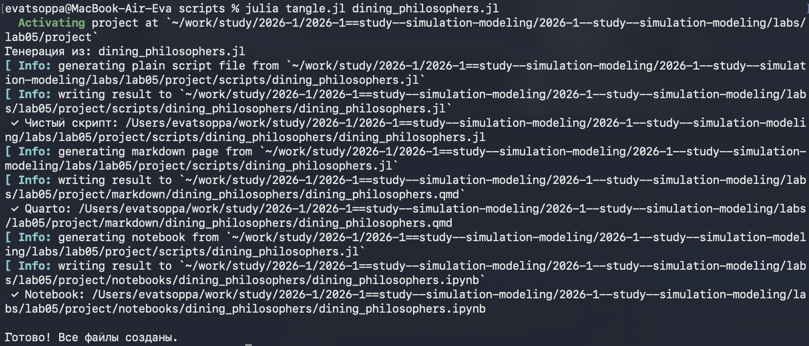{#fig-006 width=70%}

## Базовый эксперимент

Запустим файл ipynb в jupyter-notebook ([рис. @fig-007]).

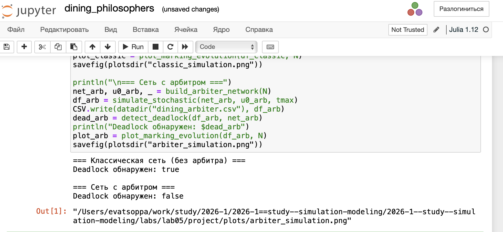{#fig-007 width=70%}

## Базовый эксперимент

В каталоге plots создались графики ([рис. @fig-008]).

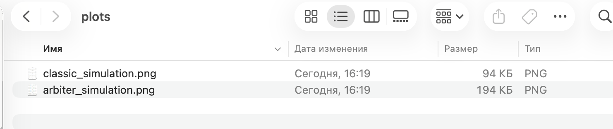{#fig-008 width=70%}

## Базовый эксперимент

Подробный просмотр графиков ([рис. @fig-009]).

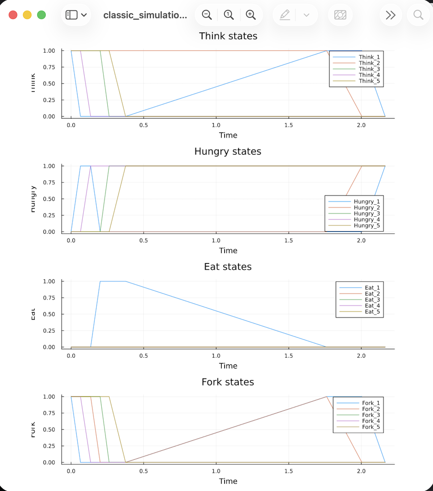{#fig-009 width=70%}

## Базовый эксперимент

Подробный просмотр графиков ([рис. @fig-010]).

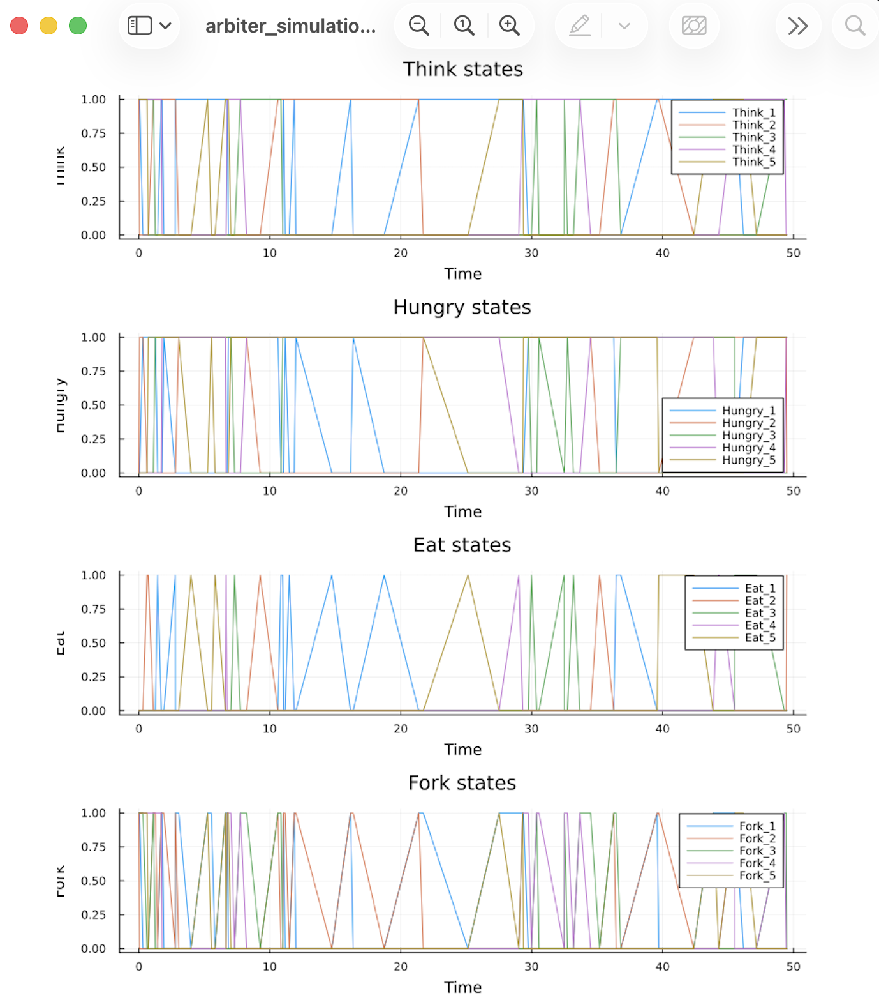{#fig-010 width=70%}

## Анимация процесса

Создадим файл scripts/dining_philosophers_animation.jl. Нужен для наглядной демонстрации динамики работы сети Петри во времени. Анимация позволяет увидеть, как меняется маркировка (фишки) в каждой
позиции, и особенно наглядно показывает возникновение deadlock в классической модели. ([рис. @fig-011]).

{#fig-011 width=70%}

## Анимация процесса

Впишем нужный код в файл dining_philosophers_animation.jl([рис. @fig-012]).

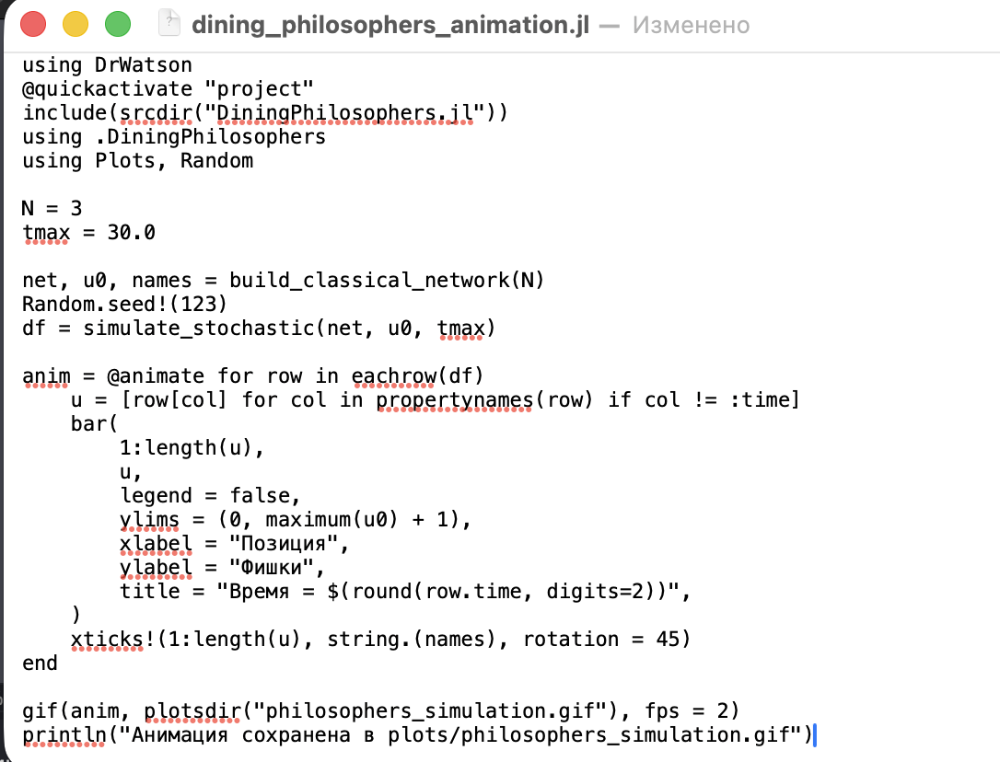{#fig-012 width=70%}

## Анимация процесса

Запустим скрипт ([рис. @fig-013]).

{#fig-013 width=70%}

## Анимация процесса

Создадим проивзодные форматы с помощью скрипта tangle.jl ([рис. @fig-014]).

{#fig-014 width=70%}

## Анимация процесса

Запустим файл ipynb в jupyter-notebook ([рис. @fig-015]).

{#fig-015 width=70%}

## Анимация процесса

В каталоге plots создались графики ([рис. @fig-016]).

{#fig-016 width=70%}

## Итоговый отчёт

Создадим файл scripts/dining_philosophers_report.jl. Нужен для сравнительного анализа двух моделей (с арбитром и без) по одному ключевому показателю — числу философов, находящихся в состоянии «Ест» (Eat_i). Скрипт генерирует сводный график. ([рис. @fig-017]).

Впишем нужный код в файл dining_philosophers_report.jl([рис. @fig-018]).

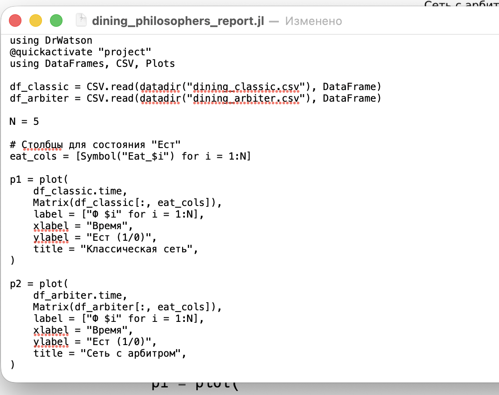{#fig-018 width=70%}

## Итоговый отчёт

Запустим скрипт ([рис. @fig-019]).

{#fig-019 width=70%}

## Итоговый отчёт

Создадим производные форматы с помощью скрипта tangle.jl ([рис. @fig-020]).

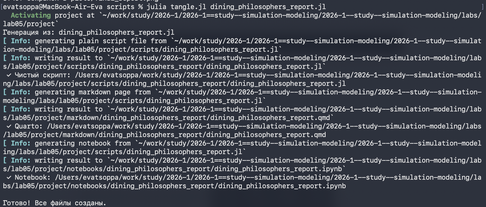{#fig-020 width=70%}

## Итоговый отчёт

Запустим файл ipynb в jupyter-notebook ([рис. @fig-021]).

{#fig-021 width=70%}

## Итоговый отчёт

В каталоге plots создался график ([рис. @fig-022]).

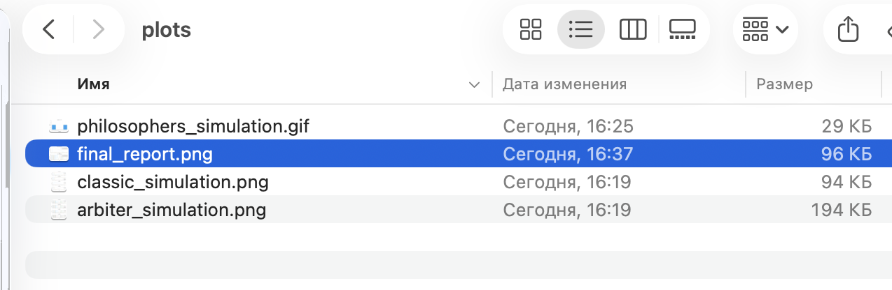{#fig-022 width=70%}

# Выводы

В ходе данной лабораторной работы мной были изучены сеть Петри для пяти философов, состояние взаимной блокировки (deadlock), когда каждый фило-
соф взял одну вилку и ждёт вторую, имитационное моделирование, наличие deadlock, модифицирование сети, чтобы предотвратить deadlock.
