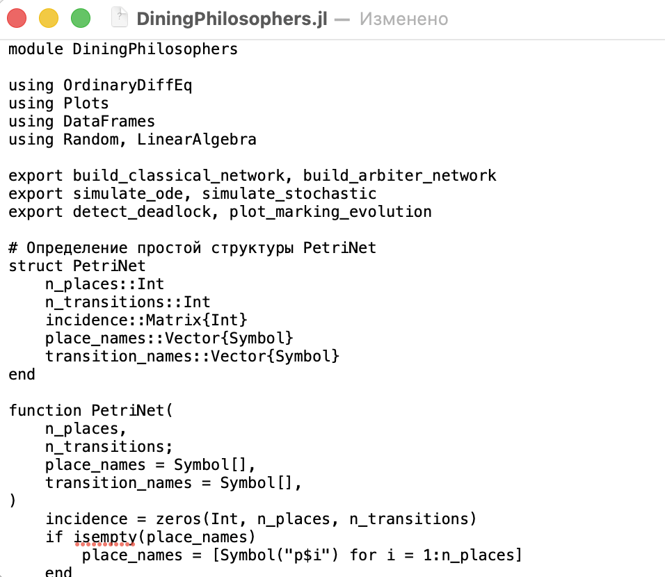
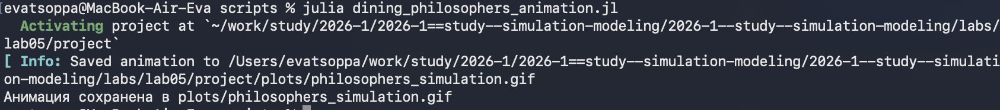
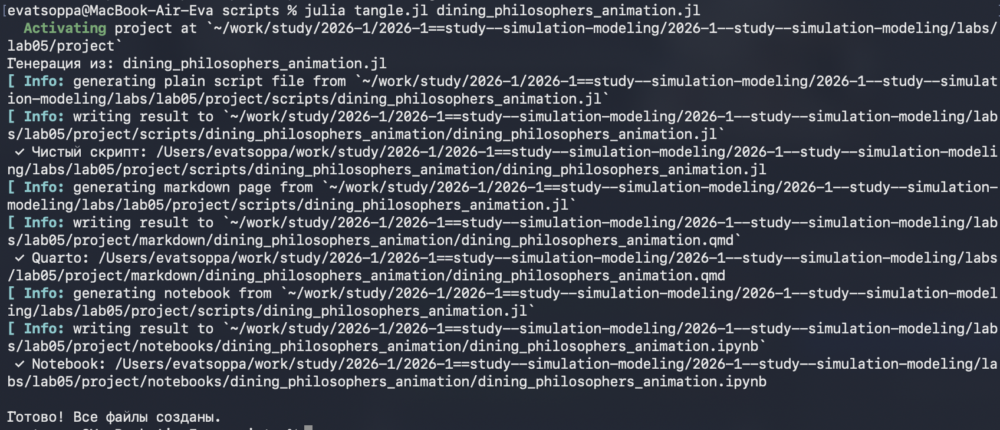
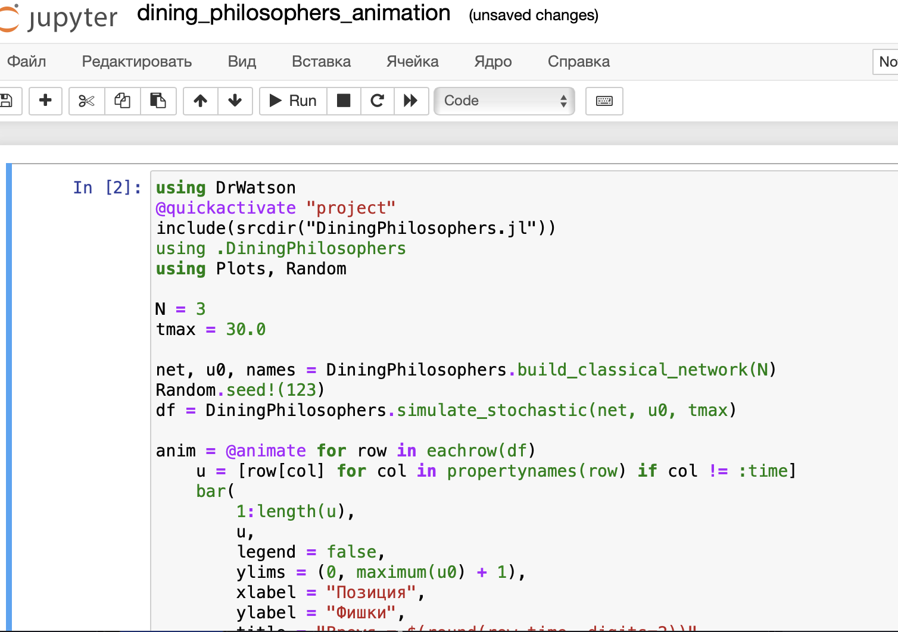
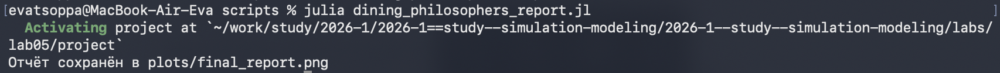
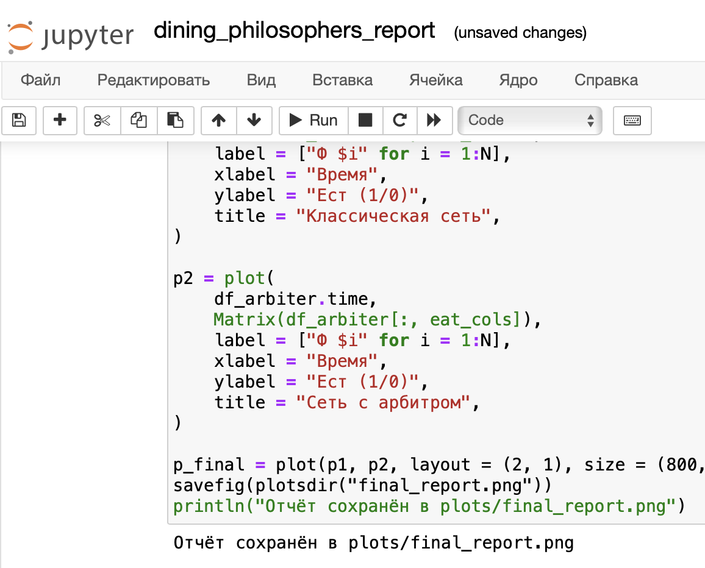

---
## Author
author:
  name: Цоппа Ева Эдуардовна
  email: 1132236045@rudn.ru
  affiliation:
    - name: Российский университет дружбы народов
      country: Российская Федерация
      postal-code: 117198
      city: Москва
      address: ул. Миклухо-Маклая, д. 5

## Title
title: "Отчёт по лабораторной работе №5"
subtitle: "Имитационное моделирование"
license: "CC BY"
---

# Теоретическое введение

## История создания

Первую идею сетей Петри Карл Адам Петри сформулировал в возрасте 13 лет
для описания химических реакций. Официальной датой рождения теории счита-
ется 1962 год, когда он защитил докторскую диссертацию «Kommunikation mit
Automaten» («Взаимодействие с автоматами») в Боннском университете. За свою
работу он получил премию Тьюринга (ACM Turing Award) — высшую награду в
области информатики.

## Общая информация

Сеть Петри есть математический аппарат для моделирования дискретных систем.
Графически она представляется как двудольный ориентированный граф двух
типов вершин: позиции (круги) и переходы (прямоугольники).
— Позиции (Places) суть пассивные элементы, описывающие состояние системы
(например, наличие ресурса или выполнение условия).
— Внутри позиции могут находиться фишки (tokens) — неотрицательное целое
число, указывающее на количество ресурсов.
— Переходы (Transitions) суть активные элементы, описывающие события или
действия системы.
— Они могут срабатывать, изменяя состояние модели.
— Дуги (Arcs) суть направленные соединения между позициями и переходами
(но не между двумя позициями или двумя переходами), которые показывают,
как состояние влияет на события и наоборот.
— Маркировка (Marking) есть распределение фишек по позициям в определён-
ный момент времени, то есть текущее состояние модели.
— Смена маркировок происходит при срабатывании переходов в соответствии
с определёнными правилами.

## Базовые элементы и принцип работы

В основе сети Петри лежит двудольный ориентированный мультиграф — это озна-
чает, что вершины в ней делятся на два типа, дуги всегда соединяют вершины
разных типов, и между двумя вершинами может быть несколько дуг.

## Свойства

Сети Петри используются не просто для моделирования, но и для проверки кор-
ректности системы. Для этого исследуются её важнейшие свойства:
— Ограниченность (Boundedness). Количество фишек в любой позиции сети нико-
гда не превысит некоторого заданного предела K. Если 𝐾 = 1, сеть называется
безопасной.
— Активность (Liveness). Для любого перехода всегда существует достижимая
маркировка, в которой он может сработать. Это гарантирует, что в системе не
будет вечных блокировок.
— Достижимость (Reachability). Можно ли из начальной маркировки 𝑀0 попасть
в некоторую желаемую маркировку 𝑀𝑘.
— Сохраняемость (Conservation). Взвешенная сумма фишек по всем позициям
остаётся постоянной (аналог закона сохранения массы или энергии).

## Применение в реальных системах

Хотя задача абстрактна, её принципы применимы к любой системе, где несколь-
ко процессов конкурируют за несколько ресурсов, требующихся одновременно:
доступ к базе данных, управление печатью на принтерах, распределение памяти,
планирование задач в операционных системах. Понимание deadlock и способов
его предотвращения есть фундаментальная часть параллельного программиро-
вания и проектирования вычислительных систем.

# Задание

— Создать рабочий каталог для кода.
— Установить необходимые пакеты.
— Выполнить предложенный код.
— Преобразовать код в литературный стиль.
— Сгенерировать из литературного кода:
    — чистый код;
    — jupyter notebook;
    — документацию в формате Quarto.
— Выполнить код из jupyter notebook.
— Интегрировать документацию в формате Quarto в отчёт.
— Добавить в код в литературном стиле вычисление для набора параметров.
— Сгенерировать из литературного кода с параметрами:
    — чистый код;
    — jupyter notebook;
    — документацию в формате Quarto.
— Выполнить код из jupyter notebook с параметрами.
— Интегрировать документацию с параметрами в формате Quarto в отчёт.

# Цель работы

Цель данной работы - построить сеть Петри для пяти философов, моделируя захват и освобождение
вилок, обнаружить состояние взаимной блокировки (deadlock), когда каждый фило-
соф взял одну вилку и ждёт вторую, провести имитационное моделирование (стохастическое и детерминирован-
ное) и выявить наличие deadlock, модифицировать сеть, чтобы предотвратить deadlock.

# Выполнение лабораторной работы

## Код модели

Создадим файл src/DiningPhilosophers.jl с определением простой структуры PetriNet([рис. @fig-001]).

{#fig-001 width=70%}

Впишем нужный код в файл DiningPhilosophers.jl ([рис. @fig-002]).

{#fig-002 width=70%}

## Базовый эксперимент

Создадим файл scripts/dining_philosophers.jl. 
Скрипт выполняет основное моделирование и сравнение двух вариантов сети
Петри:
— классическая модель (без арбитра), в которой возможна взаимная блокировка
(deadlock);
— модифицированная модель с арбитром, которая должна предотвращать
deadlock. ([рис. @fig-003]).

{#fig-003 width=70%}

Впишем нужный код в файл dining_philosophers.jl ([рис. @fig-004]).

{#fig-004 width=70%}

Запустим скрипт ([рис. @fig-005]).

{#fig-005 width=70%}

Создадим проивзодные форматы с помощью скрипта tangle.jl ([рис. @fig-006]).

{#fig-006 width=70%}

Запустим файл ipynb в jupyter-notebook ([рис. @fig-007]).

{#fig-007 width=70%}

В каталоге plots создались графики ([рис. @fig-008]).

{#fig-008 width=70%}

Подробный просмотр графиков ([рис. @fig-009]).

{#fig-009 width=70%}

Подробный просмотр графиков ([рис. @fig-010]).

{#fig-010 width=70%}

## Анимация процесса

Создадим файл scripts/dining_philosophers_animation.jl. Нужен для наглядной демонстрации динамики работы сети Петри во времени. Анимация позволяет увидеть, как меняется маркировка (фишки) в каждой
позиции, и особенно наглядно показывает возникновение deadlock в классической модели. ([рис. @fig-011]).

{#fig-011 width=70%}

Впишем нужный код в файл dining_philosophers_animation.jl([рис. @fig-012]).

{#fig-012 width=70%}

Запустим скрипт ([рис. @fig-013]).

{#fig-013 width=70%}

Создадим проивзодные форматы с помощью скрипта tangle.jl ([рис. @fig-014]).

{#fig-014 width=70%}

Запустим файл ipynb в jupyter-notebook ([рис. @fig-015]).

{#fig-015 width=70%}

В каталоге plots создались графики ([рис. @fig-016]).

{#fig-016 width=70%}

## Итоговый отчёт

Создадим файл scripts/dining_philosophers_report.jl. Нужен для сравнительного анализа двух моделей (с арбитром и без) по одному ключевому показателю — числу философов, находящихся в состоянии «Ест» (Eat_i). Скрипт генерирует сводный график. ([рис. @fig-017]).

Впишем нужный код в файл dining_philosophers_report.jl([рис. @fig-018]).

{#fig-018 width=70%}

Запустим скрипт ([рис. @fig-019]).

{#fig-019 width=70%}

Создадим производные форматы с помощью скрипта tangle.jl ([рис. @fig-020]).

{#fig-020 width=70%}

Запустим файл ipynb в jupyter-notebook ([рис. @fig-021]).

{#fig-021 width=70%}

В каталоге plots создался график ([рис. @fig-022]).

{#fig-022 width=70%}

# Выводы

В ходе данной лабораторной работы мной были изучены сеть Петри для пяти философов, состояние взаимной блокировки (deadlock), когда каждый фило-
соф взял одну вилку и ждёт вторую, имитационное моделирование, наличие deadlock, модифицирование сети, чтобы предотвратить deadlock.

# Список литературы

1. A Multi-Language Computing Environment for Literate Programming and Repro-
ducible Research / E. Schulte [et al.] // Journal of Statistical Software. — 2012. —
Vol. 46, no. 3. — ISSN 1548-7660. — DOI: 10.18637/jss.v046.i03.

2. Daisyworld: A review / A. J. Wood [et al.] // Reviews of Geophysics. — 2008. — Jan. —
Vol. 46, no. 1. — ISSN 1944-9208. — DOI: 10.1029/2006rg000217.

3. Datseris G., Vahdati A. R., DuBois T. C. Agents.jl: a performant and feature-full agent-
based modeling software of minimal code complexity // SIMULATION. — 2022. —
Jan. — P. 003754972110688. — DOI: 10.1177/00375497211068820.

4. Hethcote H. W. The Mathematics of Infectious Diseases // SIAM Review. — 2000. —
Jan. — Vol. 42, no. 4. — P. 599–653. — ISSN 1095-7200. — DOI: 10.1137/s0036144
500371907.

5. Kermack W. O., McKendrick A. G. A Contribution to the Mathematical Theory of
Epidemics // Proceedings of the Royal Society of London. Series A Containing
Papers of a Mathematical and Physical Character. — 1927. — Авг. — Т. 115, №
772. — С. 700—721. — ISSN 2053-9150. — DOI: 10.1098/rspa.1927.0118.

6. Knuth D. E. Literate Programming // The Computer Journal. — 1984. — Feb. —
Vol. 27, no. 2. — P. 97–111. — ISSN 1460-2067. — DOI: 10.1093/comjnl/27.2.97.

7. Lotka A. J. Contribution to the Theory of Periodic Reaction // The Journal of Physical
Chemistry A. — 1910. — Vol. 14, no. 3. — P. 271–274. — DOI: 10.1021/j150111a004.

8. Lotka A. J. Elements of Physical Biology. — Baltimore : Williams, Wilkins Company,
1925. — 435 p. — URL: https://archive.org/details/elementsofphysic017171mbp.

9. The Story in the Notebook / M. B. Kery [et al.] // Proceedings of the 2018 CHI
Conference on Human Factors in Computing Systems. — ACM, 04/2018. — P. 1–
11. — DOI: 10.1145/3173574.3173748.

10. Volterra V. Variations and fluctuations of the number of individuals in animal
species living together // Journal du Conseil permanent International pour l Explo-
ration de la Mer. — 1928. — Vol. 3, no. 1. — P. 3–51.

11. Watson A. J., Lovelock J. E. Biological homeostasis of the global environment: the
parable of Daisyworld // Tellus B: Chemical and Physical Meteorology. — 1983. —
Jan. — Vol. 35, no. 4. — P. 284. — ISSN 0280-6509. — DOI: 10.3402/tellusb.v35i4.1
4616.

12. Вольтерра B. Математическая теория борьбы за существование : пер. с фр. —
М. : Наука, 1976.. — 288 с. — Пер. по изд.: Volterra V. Leçons sur la Théorie ma-
thématique de la lutte pour la vie. — Paris : Gauthiers-Villars, 1931. — ISBN
2876470667. — URL : http://www.amazon.com/lecons-theorie-math-lutte-pour/d
p/2876470667%3FSubscriptionId%3D0JYN1NVW651KCA56C102%26tag%3Dte
chkie-20%26linkCode%3Dxm2%26camp%3D2025%26creative%3D165953%26
creativeASIN%3D2876470667.
