---
## Author
author:
  name: Цоппа Ева Эдуардовна
  email: 1132236045@rudn.ru
  affiliation:
    - name: Российский университет дружбы народов
      country: Российская Федерация
      postal-code: 117198
      city: Москва
      address: ул. Миклухо-Маклая, д. 5
## Title
title: Лабораторная работа №6
subtitle: Имитационное моделирование
license: CC BY
date: 2026-05-02
date-format: "YYYY-MM-DD" 
---

## Цель работы

Цель данной работы - освоить методологию моделирования динамических систем с использованием аппарата сетей Петри
 на примере эпидемиологической модели SIR (Susceptible–Infectious–Recovered), реализовать детерминированный и стохастический подходы к симуляции, 
 провести анализ чувствительности модели и визуализировать полученные результаты.

# Выполнение лабораторной работы

## Код модели

Создадим файл src/SIRPetri.jl с определением простой структуры SIRPetri([рис. @fig-001]).

{#fig-001 width=70%}

## Базовый прогон модели

Создадим файл scripts/sirpetri_run.jl ([рис. @fig-002]).

{#fig-002 width=70%}

## Базовый прогон модели

Запустим скрипт ([рис. @fig-003]).

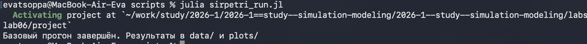{#fig-003 width=70%}

## Базовый прогон модели

Создадим проивзодные форматы с помощью скрипта tangle.jl ([рис. @fig-004]).

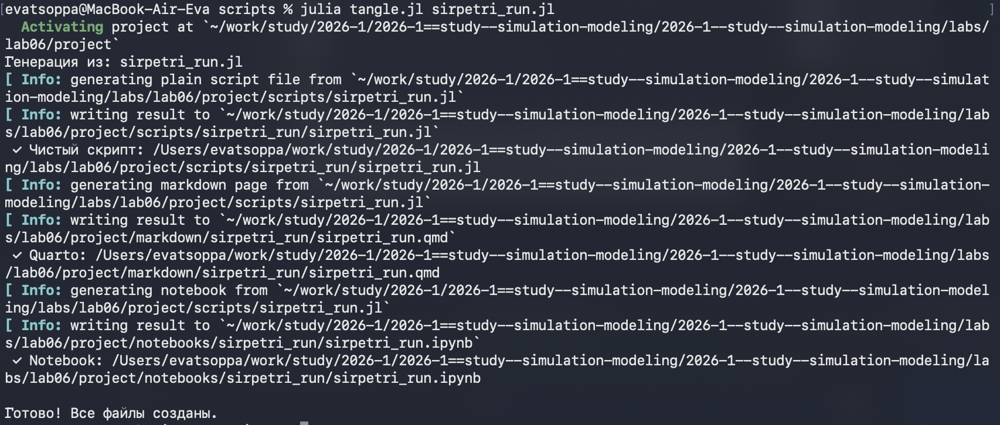{#fig-004 width=70%}

## Базовый прогон модели

Запустим файл ipynb в jupyter-notebook ([рис. @fig-005]).

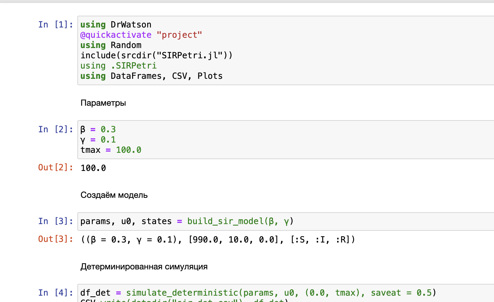{#fig-005 width=70%}

## Коэффициент заражения β

Создадим файл scripts/sirpetri_scan_parameters.jl ([рис. @fig-006]).

{#fig-006 width=70%}

## Коэффициент заражения β

Запустим скрипт ([рис. @fig-007]).

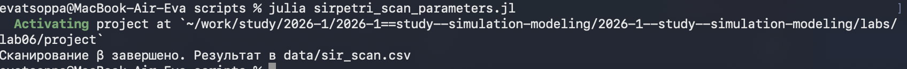{#fig-007 width=70%}

## Коэффициент заражения β

Создадим проивзодные форматы с помощью скрипта tangle.jl ([рис. @fig-008]).

{#fig-008 width=70%}

## Коэффициент заражения β

Запустим файл ipynb в jupyter-notebook ([рис. @fig-009]).

{#fig-009 width=70%}

## Анимация детерминированной динамики

Создадим файл scripts/sirpetri_animate.jl ([рис. @fig-010]).

{#fig-010 width=70%}

## Анимация детерминированной динамики

Запустим скрипт ([рис. @fig-011]).

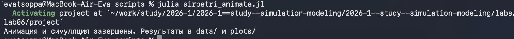{#fig-011 width=70%}

## Анимация детерминированной динамики

Создадим проивзодные форматы с помощью скрипта tangle.jl ([рис. @fig-012]).

{#fig-012 width=70%}

## Анимация детерминированной динамики

Запустим файл ipynb в jupyter-notebook ([рис. @fig-013]).

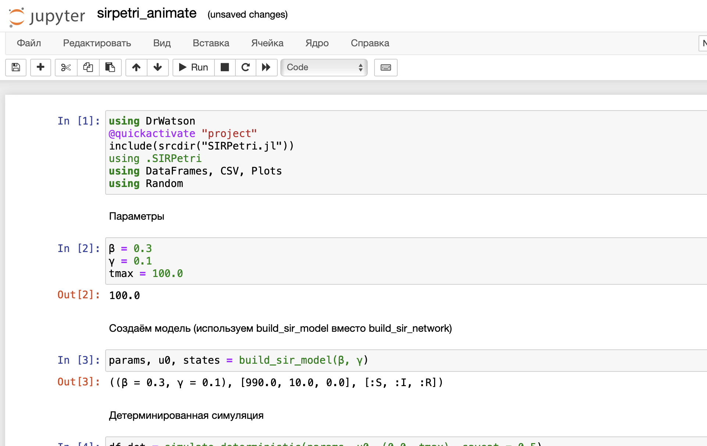{#fig-013 width=70%}

## Итоговый отчёт

Создадим файл scripts/sirpetri_report.jl ([рис. @fig-014]).

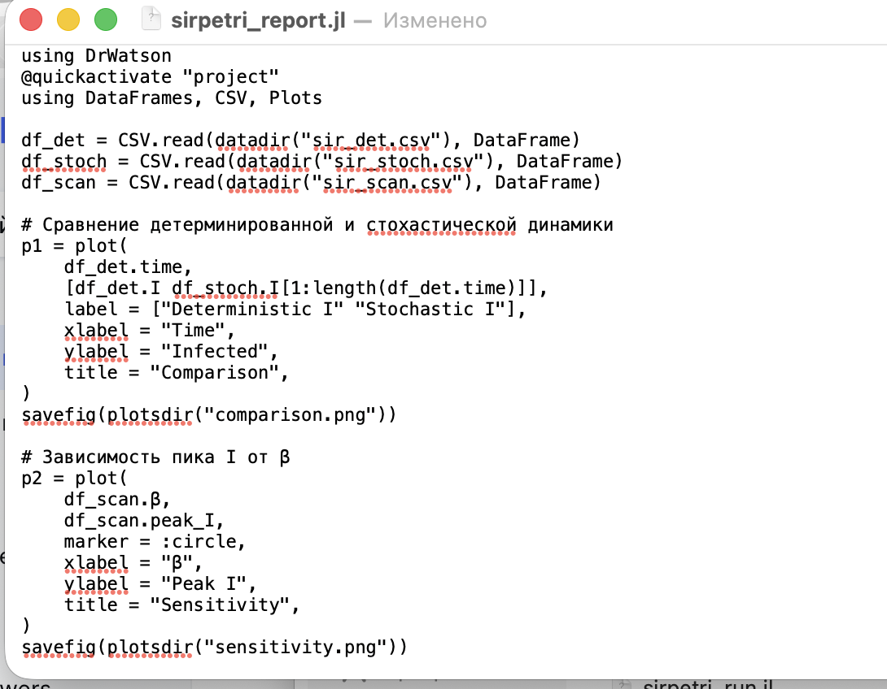{#fig-014 width=70%}

## Итоговый отчёт

Запустим скрипт ([рис. @fig-015]).

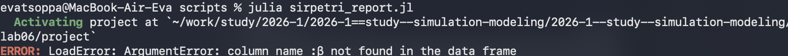{#fig-015 width=70%}

## Итоговый отчёт

Создадим проивзодные форматы с помощью скрипта tangle.jl ([рис. @fig-016]).

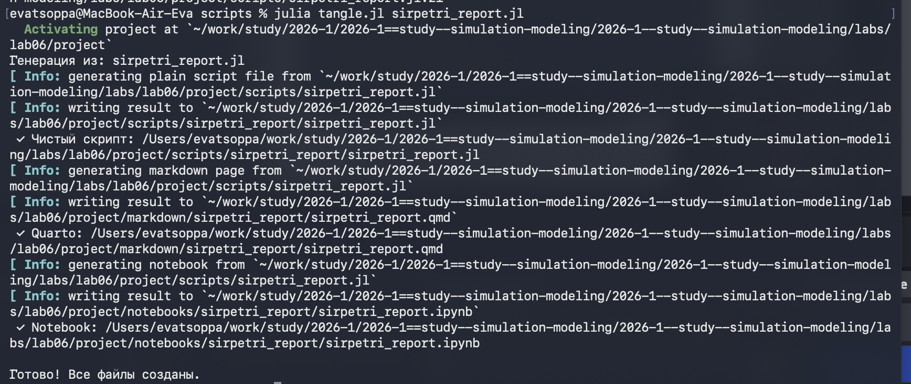{#fig-016 width=70%}

## Итоговый отчёт

Запустим файл ipynb в jupyter-notebook ([рис. @fig-017]).

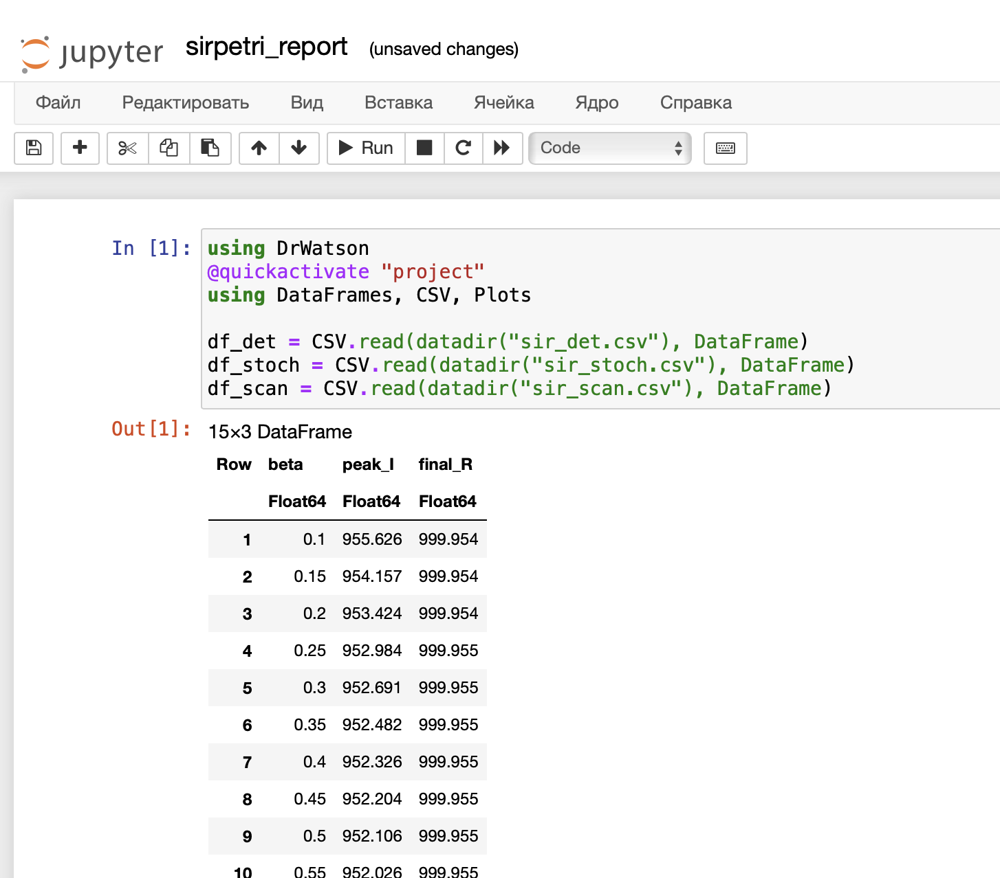{#fig-017 width=70%}

## Графики ([рис. @fig-018]).

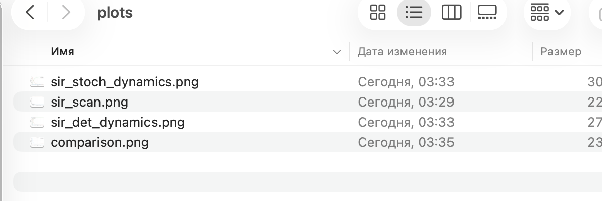{#fig-018 width=70%}

# Выводы

В ходе выполнения лабораторной работы была успешно освоена методология моделирования динамических систем с использованием аппарата сетей Петри. На примере эпидемиологической модели SIR продемонстрированы следующие теоретические положения:

Сети Петри являются эффективным инструментом для дискретно-событийного моделирования систем, где состояния описываются маркировкой позиций, а переходы — дискретными событиями.
Модель SIR (Susceptible–Infectious–Recovered) адекватно описывает распространение эпидемии в популяции, демонстрируя классические закономерности: рост числа инфицированных, достижение пика и последующий спад с переходом популяции в восприимчивое состояние.
Детерминированный и стохастический подходы дают качественно схожие результаты при большом размере популяции, однако стохастическая модель учитывает флуктуации, что важно при малых числах особей.
