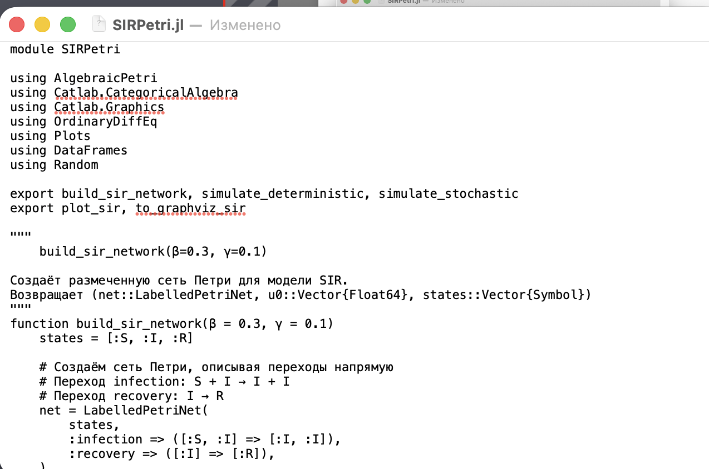
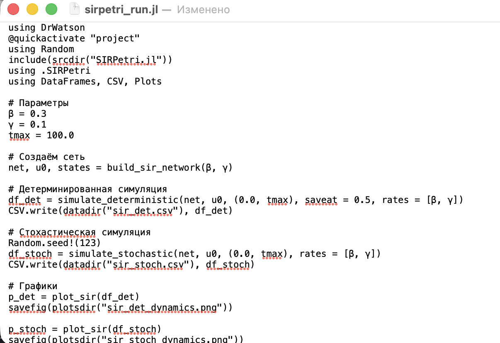
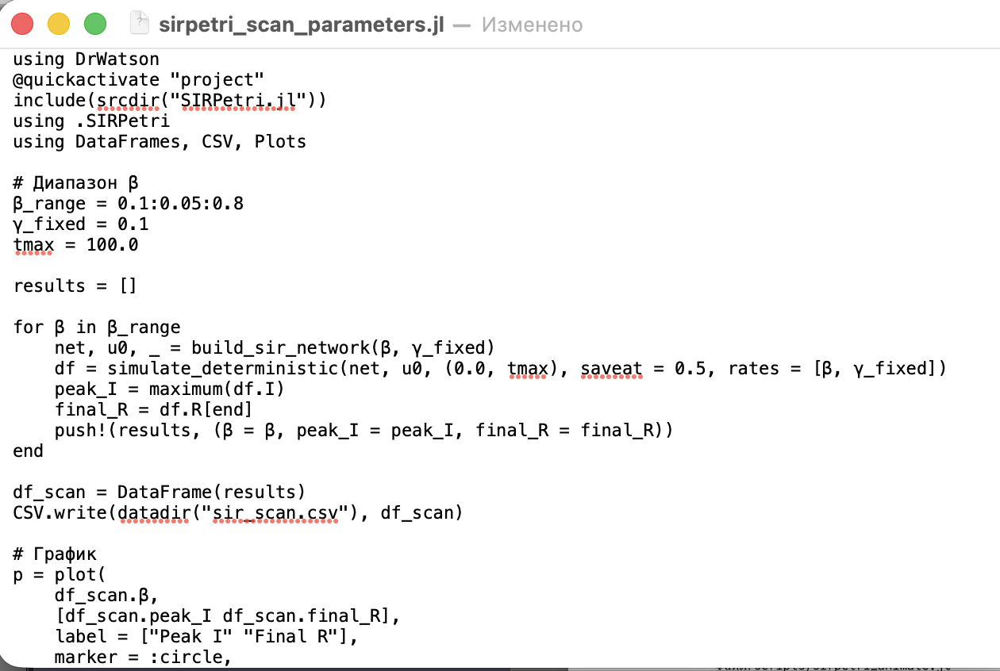
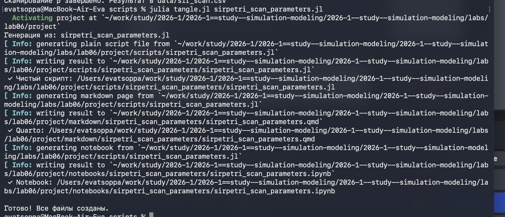
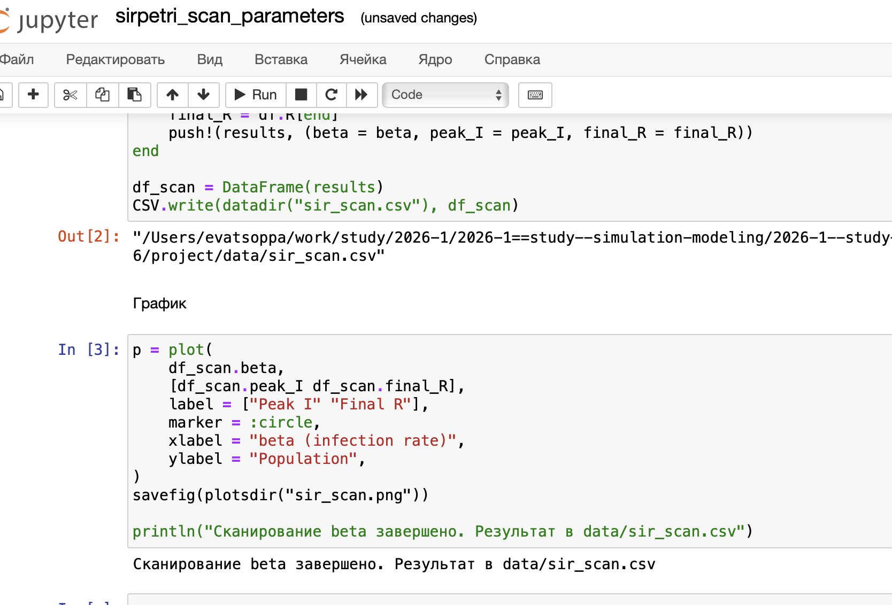
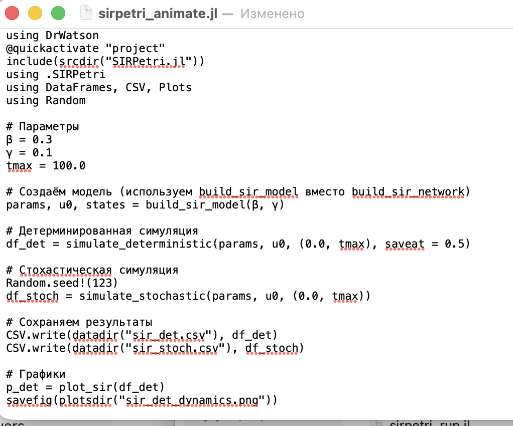
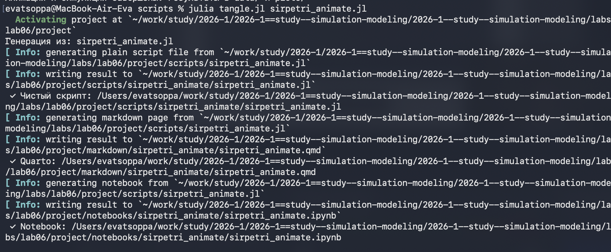

---
## Author
author:
  name: Цоппа Ева Эдуардовна
  email: 1132236045@rudn.ru
  affiliation:
    - name: Российский университет дружбы народов
      country: Российская Федерация
      postal-code: 117198
      city: Москва
      address: ул. Миклухо-Маклая, д. 5

## Title
title: "Отчёт по лабораторной работе №6"
subtitle: "Имитационное моделирование"
license: "CC BY"
---

# Теоретическое введение

## Описание модели

Реализована модель эпидемии SIR (Susceptible–Infectious–Recovered) с использо-
ванием сетей Петри. Модель описывает переходы между тремя состояниями:
— 𝑆 (восприимчивые) — могут заразиться;
— 𝐼 (инфицированные) — заражают других и выздоравливают;
— 𝑅 (выздоровевшие / с иммунитетом) — больше не участвуют в эпидемии.
Сеть Петри содержит два перехода:
— infection: 𝑆 + 𝐼 → 𝐼 + 𝐼 (скорость β);
— recovery: 𝐼 → 𝑅 (скорость γ).

## Построение сети Петри

– Функция: build_sir_network(β, γ)
— Создаёт размеченную сеть Петри (LabelledPetriNet) с двумя переходами:
— infection: S + I → I + I (скорость β)
— recovery: I → R (скорость γ)
— Возвращает:
— объект сети net,
— начальную маркировку u0 = [990.0, 10.0, 0.0],
— имена состояний [:S, :I, :R].

## Детерминированная симуляция

– Функция: simulate_deterministic(net, u0, tspan; saveat, rates)
— Строит систему обыкновенных дифференциальных уравнений (ОДУ) на основе
закона действующих масс.
— Решает её численно с помощью OrdinaryDiffEq(метод Tsit5).
— Возвращает DataFrameс колонками time, S, I, R.

## Стохастическая симуляция

– Файл: simulate_stochastic(net, u0, tspan; rates, rng)- Используется ал-
горитм Гиллеспи. - Реализует прямой метод Гиллеспи (SSA) для дискретных собы-
тий. - На каждом шаге вычисляет пропускные способности:
— a_inf = β * S * I
— a_rec = γ * I
— Случайным образом выбирает, произойдёт ли заражение или выздоровление,
и через какое время.
— Возвращает DataFrameс временами и целочисленными маркировками.

# Задание

— Создать рабочий каталог для кода.
— Установить необходимые пакеты.
— Выполнить предложенный код.
— Преобразовать код в литературный стиль.
— Сгенерировать из литературного кода:
    — чистый код;
    — jupyter notebook;
    — документацию в формате Quarto.
— Выполнить код из jupyter notebook.
— Интегрировать документацию в формате Quarto в отчёт.
— Добавить в код в литературном стиле вычисление для набора параметров.
— Сгенерировать из литературного кода с параметрами:
    — чистый код;
    — jupyter notebook;
    — документацию в формате Quarto.
— Выполнить код из jupyter notebook с параметрами.
— Интегрировать документацию с параметрами в формате Quarto в отчёт.

# Цель работы

Цель данной работы - освоить методологию моделирования динамических систем с использованием аппарата сетей Петри
 на примере эпидемиологической модели SIR (Susceptible–Infectious–Recovered), реализовать детерминированный и стохастический подходы к симуляции, 
 провести анализ чувствительности модели и визуализировать полученные результаты.

# Выполнение лабораторной работы

## Код модели

Создадим файл src/SIRPetri.jl с определением простой структуры SIRPetri([рис. @fig-001]).

{#fig-001 width=70%}

## Базовый прогон модели

Создадим файл scripts/sirpetri_run.jl ([рис. @fig-002]).

{#fig-002 width=70%}

Запустим скрипт ([рис. @fig-003]).

{#fig-003 width=70%}

Создадим проивзодные форматы с помощью скрипта tangle.jl ([рис. @fig-004]).

{#fig-004 width=70%}

Запустим файл ipynb в jupyter-notebook ([рис. @fig-005]).

{#fig-005 width=70%}

## Коэффициент заражения β

Создадим файл scripts/sirpetri_scan_parameters.jl ([рис. @fig-006]).

{#fig-006 width=70%}

Запустим скрипт ([рис. @fig-007]).

{#fig-007 width=70%}

Создадим проивзодные форматы с помощью скрипта tangle.jl ([рис. @fig-008]).

{#fig-008 width=70%}

Запустим файл ipynb в jupyter-notebook ([рис. @fig-009]).

{#fig-009 width=70%}

## Анимация детерминированной динамики

Создадим файл scripts/sirpetri_animate.jl ([рис. @fig-010]).

{#fig-010 width=70%}

Запустим скрипт ([рис. @fig-011]).

{#fig-011 width=70%}

Создадим проивзодные форматы с помощью скрипта tangle.jl ([рис. @fig-012]).

{#fig-012 width=70%}

Запустим файл ipynb в jupyter-notebook ([рис. @fig-013]).

{#fig-013 width=70%}

## Итоговый отчёт

Создадим файл scripts/sirpetri_report.jl ([рис. @fig-014]).

{#fig-014 width=70%}

Запустим скрипт ([рис. @fig-015]).

{#fig-015 width=70%}

Создадим проивзодные форматы с помощью скрипта tangle.jl ([рис. @fig-016]).

{#fig-016 width=70%}

Запустим файл ipynb в jupyter-notebook ([рис. @fig-017]).

{#fig-017 width=70%}

## Графики ([рис. @fig-018]).

{#fig-018 width=70%}

# Выводы

В ходе выполнения лабораторной работы была успешно освоена методология моделирования динамических систем с использованием аппарата сетей Петри. На примере эпидемиологической модели SIR продемонстрированы следующие теоретические положения:

Сети Петри являются эффективным инструментом для дискретно-событийного моделирования систем, где состояния описываются маркировкой позиций, а переходы — дискретными событиями.
Модель SIR (Susceptible–Infectious–Recovered) адекватно описывает распространение эпидемии в популяции, демонстрируя классические закономерности: рост числа инфицированных, достижение пика и последующий спад с переходом популяции в восприимчивое состояние.
Детерминированный и стохастический подходы дают качественно схожие результаты при большом размере популяции, однако стохастическая модель учитывает флуктуации, что важно при малых числах особей.

# Список литературы

1. A Multi-Language Computing Environment for Literate Programming and Repro-
ducible Research / E. Schulte [et al.] // Journal of Statistical Software. — 2012. —
Vol. 46, no. 3. — ISSN 1548-7660. — DOI: 10.18637/jss.v046.i03.

2. Daisyworld: A review / A. J. Wood [et al.] // Reviews of Geophysics. — 2008. — Jan. —
Vol. 46, no. 1. — ISSN 1944-9208. — DOI: 10.1029/2006rg000217.

3. Datseris G., Vahdati A. R., DuBois T. C. Agents.jl: a performant and feature-full agent-
based modeling software of minimal code complexity // SIMULATION. — 2022. —
Jan. — P. 003754972110688. — DOI: 10.1177/00375497211068820.

4. Hethcote H. W. The Mathematics of Infectious Diseases // SIAM Review. — 2000. —
Jan. — Vol. 42, no. 4. — P. 599–653. — ISSN 1095-7200. — DOI: 10.1137/s0036144
500371907.

5. Kermack W. O., McKendrick A. G. A Contribution to the Mathematical Theory of
Epidemics // Proceedings of the Royal Society of London. Series A Containing
Papers of a Mathematical and Physical Character. — 1927. — Авг. — Т. 115, №
772. — С. 700—721. — ISSN 2053-9150. — DOI: 10.1098/rspa.1927.0118.

6. Knuth D. E. Literate Programming // The Computer Journal. — 1984. — Feb. —
Vol. 27, no. 2. — P. 97–111. — ISSN 1460-2067. — DOI: 10.1093/comjnl/27.2.97.

7. Lotka A. J. Contribution to the Theory of Periodic Reaction // The Journal of Physical
Chemistry A. — 1910. — Vol. 14, no. 3. — P. 271–274. — DOI: 10.1021/j150111a004.

8. Lotka A. J. Elements of Physical Biology. — Baltimore : Williams, Wilkins Company,
1925. — 435 p. — URL: https://archive.org/details/elementsofphysic017171mbp.

9. The Story in the Notebook / M. B. Kery [et al.] // Proceedings of the 2018 CHI
Conference on Human Factors in Computing Systems. — ACM, 04/2018. — P. 1–
11. — DOI: 10.1145/3173574.3173748.

10. Volterra V. Variations and fluctuations of the number of individuals in animal
species living together // Journal du Conseil permanent International pour l Explo-
ration de la Mer. — 1928. — Vol. 3, no. 1. — P. 3–51.

11. Watson A. J., Lovelock J. E. Biological homeostasis of the global environment: the
parable of Daisyworld // Tellus B: Chemical and Physical Meteorology. — 1983. —
Jan. — Vol. 35, no. 4. — P. 284. — ISSN 0280-6509. — DOI: 10.3402/tellusb.v35i4.1
4616.

12. Вольтерра B. Математическая теория борьбы за существование : пер. с фр. —
М. : Наука, 1976.. — 288 с. — Пер. по изд.: Volterra V. Leçons sur la Théorie ma-
thématique de la lutte pour la vie. — Paris : Gauthiers-Villars, 1931. — ISBN
2876470667. — URL : http://www.amazon.com/lecons-theorie-math-lutte-pour/d
p/2876470667%3FSubscriptionId%3D0JYN1NVW651KCA56C102%26tag%3Dte
chkie-20%26linkCode%3Dxm2%26camp%3D2025%26creative%3D165953%26
creativeASIN%3D2876470667.
