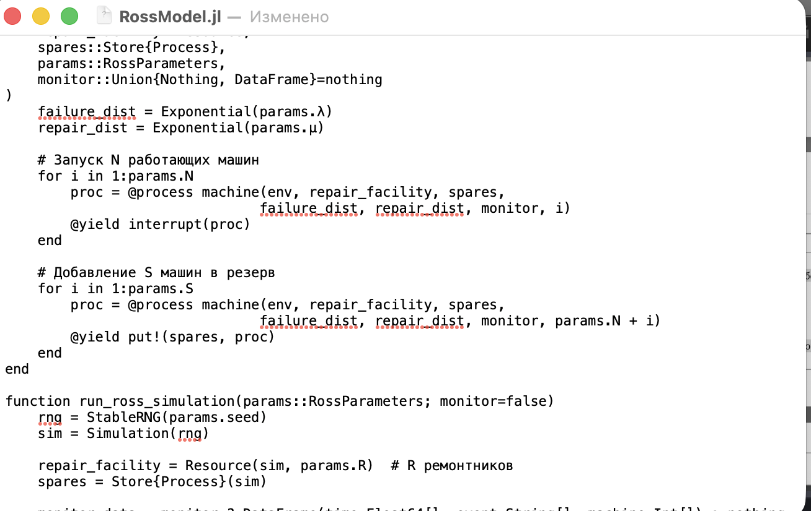
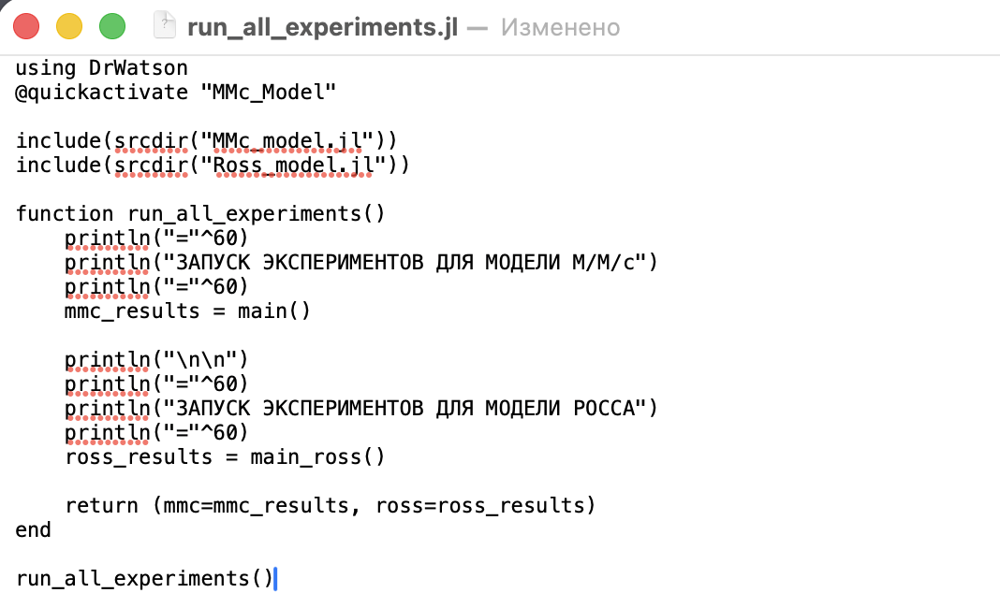
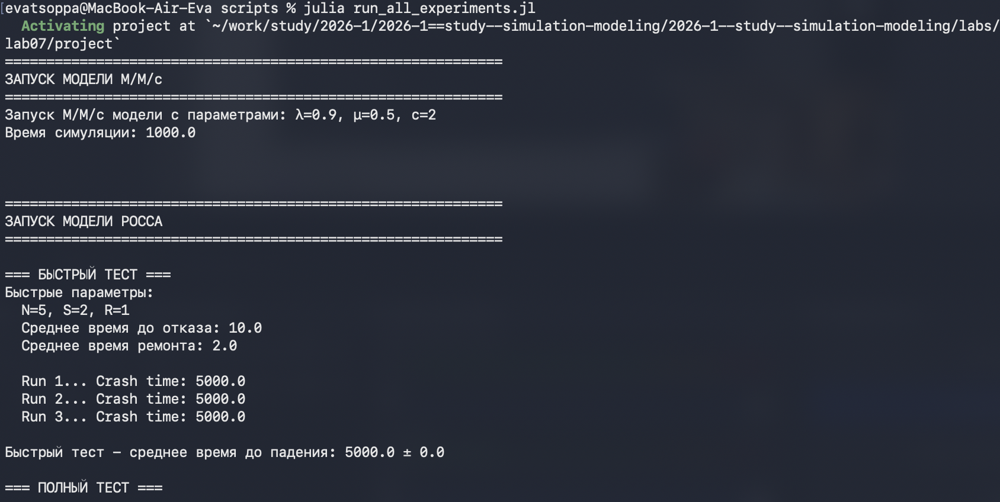
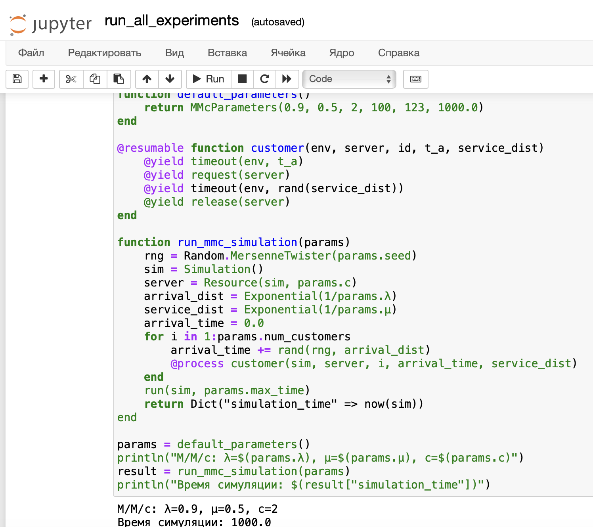
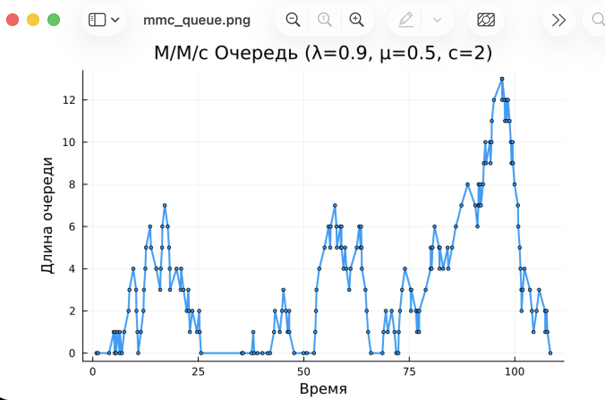

---
## Author
author:
  name: Цоппа Ева Эдуардовна
  email: 1132236045@rudn.ru
  affiliation:
    - name: Российский университет дружбы народов
      country: Российская Федерация
      postal-code: 117198
      city: Москва
      address: ул. Миклухо-Маклая, д. 5
## Title
title: Лабораторная работа №7
subtitle: Имитационное моделирование
license: CC BY
date: 2026-05-16
date-format: "YYYY-MM-DD" 
---

## Цель работы

Целью данной лабораторной работы является освоение методов дискретно-событийного моделирования на примере
 двух классических систем массового обслуживания: многоканальной системы M/M/c и системы Росса с резервированием 
 и ремонтом. В ходе работы необходимо:

Реализовать имитационные модели систем M/M/c и Росса с использованием языка Julia и пакета ConcurrentSim
Провести анализ основных характеристик систем: загрузка, время ожидания, длина очереди, время до отказа
Построить графики, иллюстрирующие поведение систем во времени
Сравнить результаты имитационного моделирования с аналитическими решениями
Оценить влияние параметров (число каналов, резервных машин, ремонтников) на эффективность системы

# Выполнение лабораторной работы

## Создание файлов

Создадим файл src/MMcQueue.jl ([рис. @fig-001]).

{#fig-001 width=70%}

## Создание файлов

Создадим файл src/RossModel.jl ([рис. @fig-002]).

{#fig-002 width=70%}

## Создание файлов

Создадим скрипт scripts/run_all_experiments.jl для запуска моделей ([рис. @fig-003]).

{#fig-003 width=70%}

## Реализация

Запускаем с помощью julia ([рис. @fig-004]).

{#fig-004 width=70%}

## Реализация

Создаём производные форматы с помощью tangle.jl 

Запускаем jupyter notebook ([рис. @fig-005]).

{#fig-005 width=70%}

## Реализация

Получившийся график ([рис. @fig-006]).

{#fig-006 width=70%}

## Реализация

Получившийся график ([рис. @fig-007]).

{#fig-007 width=70%}

## Реализация

Получившийся график ([рис. @fig-008]).

{#fig-008 width=70%}

## Реализация

Получившийся график ([рис. @fig-009]).

{#fig-009 width=70%}

## Реализация

Получившийся график ([рис. @fig-010]).

{#fig-010 width=70%}

# Выводы

Дискретно-событийное моделирование является мощным инструментом для анализа сложных систем массового обслуживания. 
В ходе работы были успешно реализованы две модели, получены результаты, соответствующие теоретическим ожиданиям, 
и построены графики, наглядно иллюстрирующие поведение систем. Julia с пакетом ConcurrentSim показала себя как 
эффективный инструмент для имитационного моделирования, позволяющий легко изменять параметры и расширять 
функциональность моделей.