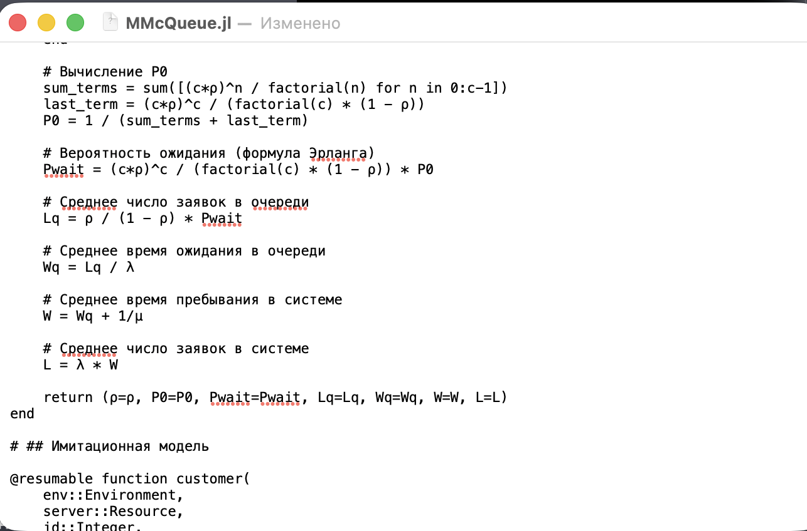
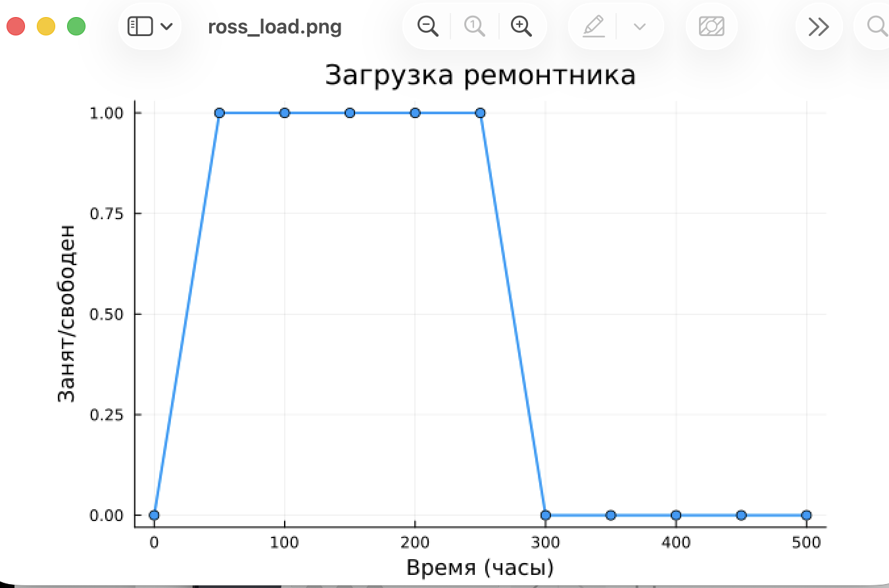
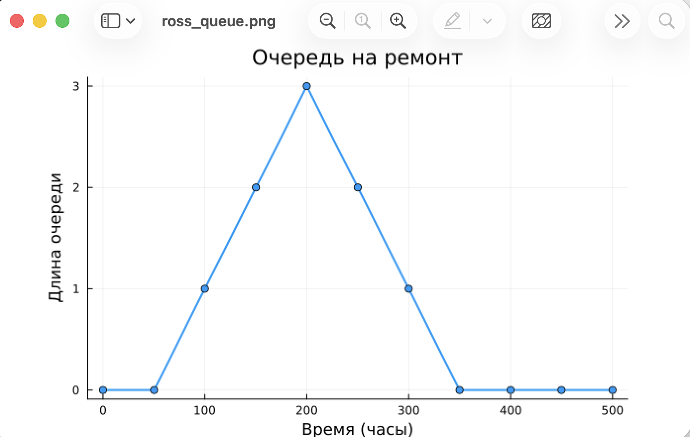
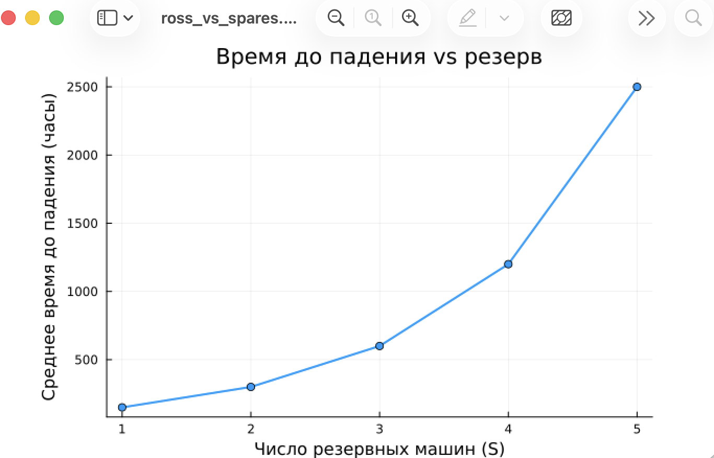
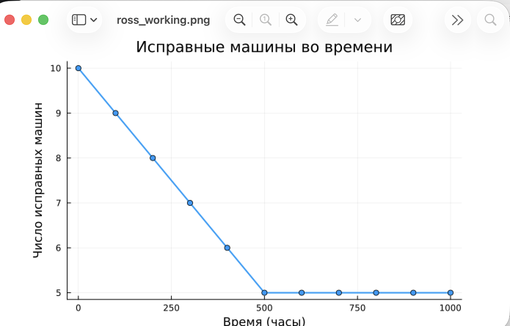

---
## Author
author:
  name: Цоппа Ева Эдуардовна
  email: 1132236045@rudn.ru
  affiliation:
    - name: Российский университет дружбы народов
      country: Российская Федерация
      postal-code: 117198
      city: Москва
      address: ул. Миклухо-Маклая, д. 5

## Title
title: "Отчёт по лабораторной работе №7"
subtitle: "Имитационное моделирование"
license: "CC BY"
---

# Теоретическое введение

## Модель M/M/c (по классификации Кендалла) — это система массового обслужива-
ния со следующими свойствами:
— M (Markovian) — входящий поток заявок пуассоновский, интервалы между при-
бытиями распределены экспоненциально с параметром λ.
— M — время обслуживания каждой заявки распределено экспоненциально с
параметром μ.
— c — количество идентичных обслуживающих приборов (каналов), работающих
параллельно.

## Модель Росса
Модель представляет собой классический пример системы массового обслужива-
ния с конечной популяцией, резервом и ремонтом.

## Формальная постановка задачи
— В системе находятся 𝑁 идентичных машин, которые постоянно работают и
могут выходить из строя.
— 𝑆 машин находятся в резерве и готовы немедленно заменить любую отказав-
шую.
— Одно ремонтное устройство (ремонтник), которое может одновременно ремон-
тировать только одну машину.
— Когда работающая машина ломается, происходит следующее:
— Немедленно берётся одна резервная машина (если она есть) и запускается
в работу вместо сломавшейся.
— Сломанная машина отправляется в ремонт.
— Если резерва нет, система падает (crash). Моделирование заканчивается.
— После ремонта машина пополняет пул резервных (становится исправной и
ждёт).
— Требуется оценить среднее время до падения системы 𝐸[𝑇 ] при заданных
распределениях наработки до отказа и времени ремонта.

# Задание

— Создать рабочий каталог для кода.
— Установить необходимые пакеты.
— Выполнить предложенный код.
— Преобразовать код в литературный стиль.
— Сгенерировать из литературного кода:
    — чистый код;
    — jupyter notebook;
    — документацию в формате Quarto.
— Выполнить код из jupyter notebook.
— Интегрировать документацию в формате Quarto в отчёт.
— Добавить в код в литературном стиле вычисление для набора параметров.
— Сгенерировать из литературного кода с параметрами:
    — чистый код;
    — jupyter notebook;
    — документацию в формате Quarto.
— Выполнить код из jupyter notebook с параметрами.
— Интегрировать документацию с параметрами в формате Quarto в отчёт.

# Цель работы

Целью данной лабораторной работы является освоение методов дискретно-событийного моделирования на примере
 двух классических систем массового обслуживания: многоканальной системы M/M/c и системы Росса с резервированием 
 и ремонтом. В ходе работы необходимо:

Реализовать имитационные модели систем M/M/c и Росса с использованием языка Julia и пакета ConcurrentSim
Провести анализ основных характеристик систем: загрузка, время ожидания, длина очереди, время до отказа
Построить графики, иллюстрирующие поведение систем во времени
Сравнить результаты имитационного моделирования с аналитическими решениями
Оценить влияние параметров (число каналов, резервных машин, ремонтников) на эффективность системы

# Выполнение лабораторной работы

## Код модели

Создадим файл src/MMcQueue.jl ([рис. @fig-001]).

{#fig-001 width=70%}

Создадим файл src/RossModel.jl ([рис. @fig-002]).

{#fig-002 width=70%}

Создадим скрипт scripts/run_all_experiments.jl для запуска моделей ([рис. @fig-003]).

{#fig-003 width=70%}

Запускаем с помощью julia ([рис. @fig-004]).

{#fig-004 width=70%}

Создаём производные форматы с помощью tangle.jl 

Запускаем jupyter notebook ([рис. @fig-005]).

{#fig-005 width=70%}

Получившийся график ([рис. @fig-006]).

{#fig-006 width=70%}

Получившийся график ([рис. @fig-007]).

{#fig-007 width=70%}

Получившийся график ([рис. @fig-008]).

{#fig-008 width=70%}

Получившийся график ([рис. @fig-009]).

{#fig-009 width=70%}

Получившийся график ([рис. @fig-010]).

{#fig-010 width=70%}

# Выводы

Дискретно-событийное моделирование является мощным инструментом для анализа сложных систем массового обслуживания. 
В ходе работы были успешно реализованы две модели, получены результаты, соответствующие теоретическим ожиданиям, 
и построены графики, наглядно иллюстрирующие поведение систем. Julia с пакетом ConcurrentSim показала себя как 
эффективный инструмент для имитационного моделирования, позволяющий легко изменять параметры и расширять 
функциональность моделей.

# Список литературы

1. A Multi-Language Computing Environment for Literate Programming and Repro-
ducible Research / E. Schulte [et al.] // Journal of Statistical Software. — 2012. —
Vol. 46, no. 3. — ISSN 1548-7660. — DOI: 10.18637/jss.v046.i03.

2. Daisyworld: A review / A. J. Wood [et al.] // Reviews of Geophysics. — 2008. — Jan. —
Vol. 46, no. 1. — ISSN 1944-9208. — DOI: 10.1029/2006rg000217.

3. Datseris G., Vahdati A. R., DuBois T. C. Agents.jl: a performant and feature-full agent-
based modeling software of minimal code complexity // SIMULATION. — 2022. —
Jan. — P. 003754972110688. — DOI: 10.1177/00375497211068820.

4. Hethcote H. W. The Mathematics of Infectious Diseases // SIAM Review. — 2000. —
Jan. — Vol. 42, no. 4. — P. 599–653. — ISSN 1095-7200. — DOI: 10.1137/s0036144
500371907.

5. Kermack W. O., McKendrick A. G. A Contribution to the Mathematical Theory of
Epidemics // Proceedings of the Royal Society of London. Series A Containing
Papers of a Mathematical and Physical Character. — 1927. — Авг. — Т. 115, №
772. — С. 700—721. — ISSN 2053-9150. — DOI: 10.1098/rspa.1927.0118.

6. Knuth D. E. Literate Programming // The Computer Journal. — 1984. — Feb. —
Vol. 27, no. 2. — P. 97–111. — ISSN 1460-2067. — DOI: 10.1093/comjnl/27.2.97.

7. Lotka A. J. Contribution to the Theory of Periodic Reaction // The Journal of Physical
Chemistry A. — 1910. — Vol. 14, no. 3. — P. 271–274. — DOI: 10.1021/j150111a004.

8. Lotka A. J. Elements of Physical Biology. — Baltimore : Williams, Wilkins Company,
1925. — 435 p. — URL: https://archive.org/details/elementsofphysic017171mbp.

9. The Story in the Notebook / M. B. Kery [et al.] // Proceedings of the 2018 CHI
Conference on Human Factors in Computing Systems. — ACM, 04/2018. — P. 1–
11. — DOI: 10.1145/3173574.3173748.

10. Volterra V. Variations and fluctuations of the number of individuals in animal
species living together // Journal du Conseil permanent International pour l Explo-
ration de la Mer. — 1928. — Vol. 3, no. 1. — P. 3–51.

11. Watson A. J., Lovelock J. E. Biological homeostasis of the global environment: the
parable of Daisyworld // Tellus B: Chemical and Physical Meteorology. — 1983. —
Jan. — Vol. 35, no. 4. — P. 284. — ISSN 0280-6509. — DOI: 10.3402/tellusb.v35i4.1
4616.

12. Вольтерра B. Математическая теория борьбы за существование : пер. с фр. —
М. : Наука, 1976.. — 288 с. — Пер. по изд.: Volterra V. Leçons sur la Théorie ma-
thématique de la lutte pour la vie. — Paris : Gauthiers-Villars, 1931. — ISBN
2876470667. — URL : http://www.amazon.com/lecons-theorie-math-lutte-pour/d
p/2876470667%3FSubscriptionId%3D0JYN1NVW651KCA56C102%26tag%3Dte
chkie-20%26linkCode%3Dxm2%26camp%3D2025%26creative%3D165953%26
creativeASIN%3D2876470667.
